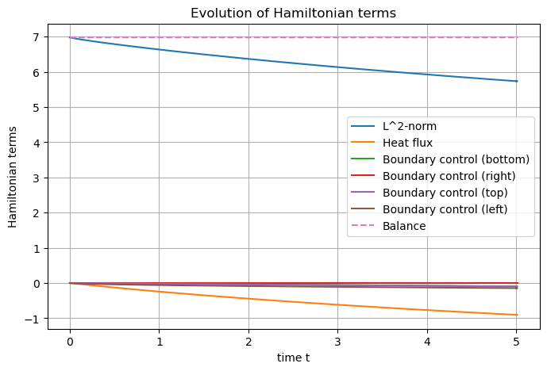

The heat equation
=================

.. _Heat_2D:

.. automodule:: examples.heat
   :members:
   :undoc-members:
   :show-inheritance:

This example is the first simple case of intrinsically port-Hamiltonian
Differential Algebraic Equation (known as pH-DAE).

The so-called *heat equation* is driven by the first law of
thermodynamics.

Let :math:`\Omega = (0,2) \times (0,1)` be a bounded open connected set,
with mass density :math:`\rho(x)`, for all :math:`x \in \Omega`, and
:math:`n` be the outward unit normal at the boundary
:math:`\partial\Omega`. We assume that:

-  The domain :math:`\Omega` does not change over time: *i.e.* we work
   at constant volume in a solid
-  No chemical reaction is to be found in the domain
-  Dulong-Petit’s model: internal energy is proportional to temperature

Let us denotes:

-  :math:`u` the internal energy density
-  :math:`\mathbf{J}_Q` the heat flux
-  :math:`T` the local temperature
-  :math:`C_V := \left( \frac{d u}{d T} \right)_V` the isochoric heat
   capacity

The first law of thermodynamics, stating that in an isolated system, the
energy is preserved, reads:

.. math::

       \rho(x) \partial_t u(t, x) = - {\rm div} \left( J_Q(t, x) \right), \qquad \forall t \ge 0, x \in \Omega.

Under Dulong-Petit’s model, one has :math:`u = C_V T`, which leads to

.. math::

       \rho(x) C_V(x) \partial_t T(t, x) = - {\rm div} \left( J_Q(t, x) \right), \qquad \forall t \ge 0, x \in \Omega.

As constitutive relation, the classical Fourier’s law is considered:

.. math::

       J_Q(t, x) = - \lambda(x) \cdot {\rm grad} \left( T(t, x) \right), \qquad \forall t \ge 0, x \in \Omega,

where :math:`\lambda` is the **tensor-valued** heat conductivity of the
medium.

We assume furthermore that one wants to control the temperature
:math:`T = u_D` at the lower, right and upper part of the boundary,
denoted :math:`\Gamma_D` (a **D**\ irichlet boundary condition), while
the inward heat flux :math:`-J_Q \cdot n = u_N` will be prescribed at
the left edge, denoted :math:`\Gamma_N` (a **N**\ eumann boundary
condition). Thus, the observations are :math:`y_D = - J_Q \cdot n` and
:math:`y_N = T` respectively.

Port-Hamiltonian framework
--------------------------

Let us choose as Hamiltonian the usual quadratic form for parabolic
equation

.. math::

       \mathcal{H}(T(t,x)) := \frac{1}{2} \int_\Omega \rho(x) Cv(x) T^2(t,x) {\rm d}x.

Computing the variational derivative with respect to the weigthed
:math:`L^2`-inner product
:math:`\left( \phi, \psi \right)_\Omega := \int_\Omega \rho(x) C_V(x) \phi(x) \psi(x) {\rm d} x`
leads to a co-state variable :math:`e_T = T`. Hence, the first law of
thermodynamics may be written as

.. math::

       \begin{pmatrix} \rho C_V T \\ \star \end{pmatrix} = \begin{bmatrix} 0 & -{\rm div} \\ \star & 0 \end{bmatrix} \begin{pmatrix} T \\ J_Q \end{pmatrix}.

As we want a *formally* skew-symmetric :math:`J` operator, it has to be
completed with :math:`-{\rm grad}`, then

.. math::

       \begin{pmatrix} \rho C_V T \\ f_Q \end{pmatrix} = \begin{bmatrix} 0 & -{\rm div} \\ -{\rm grad} & 0 \end{bmatrix} \begin{pmatrix} T \\ J_Q \end{pmatrix},

and Fourier’s law provides the constitutive relation
:math:`J_Q = \lambda f_Q` to close the system.

**Remark:** :math:`\rho C_V` appears against the state variable as the
weight of the :math:`L^2`-inner product, it should not be ommited in the
mass matrix at the discrete level.

The **power balance** satisfied by the **Hamiltonian** is

.. math::

       \frac{\rm d}{{\rm d}t} \mathcal{H}(t) = \underbrace{- \int_\Omega \lambda \| f_Q(t,x) \|^2 {\rm d} x}_{\text{dissipated power}} \underbrace{+ \left\langle u_D(t,\cdot), y_D(t,\cdot) \right\rangle_{\Gamma_D}}_{\text{power flowing through }\Gamma_D} \underbrace{+ \left\langle y_N(t,\cdot), u_N(t,\cdot)\right\rangle_{\Gamma_N}}_{\text{power flowing through }\Gamma_N},

where :math:`\left\langle \cdot, \cdot \right\rangle_{\Gamma}` is a
boundary duality bracket :math:`H^\frac12, H^{-\frac12}` at the boundary
:math:`\Gamma`.

Structure-preserving discretization
-----------------------------------

Let :math:`\varphi_T` and :math:`\varphi_Q` be smooth test functions on
:math:`\Omega`, and :math:`\psi_N` and :math:`\psi_D` be smooth test
functions on :math:`\Gamma_N` and :math:`\Gamma_D` respectively. One can
write the weak formulation of the **Dirac Structure** as follows

.. math::

       \left\lbrace
       \begin{array}{rcl}
       \int_\Omega \rho(x) C_V(x) \partial_t T(t,x) \varphi_T(x) {\rm d}x &=& - \int_\Omega {\rm div} \left( J_Q(t,x) \right) \varphi_T(x) {\rm d}x, \\
       \int_\Omega f_Q(t,x) \cdot \varphi_Q(x) {\rm d}x &=& - \int_\Omega {\rm grad} \left( T(t,x) \right) \cdot \varphi_Q(x) {\rm d}x, \\
       \left\langle y_D, \psi_D \right\rangle_{\Gamma_D} &=& \left\langle -J_Q \cdot n, \psi_D \right\rangle_{\Gamma_D}, \\
       \left\langle u_N, \psi_N \right\rangle_{\Gamma_N} &=& \left\langle -J_Q \cdot n, \psi_N \right\rangle_{\Gamma_N}.
       \end{array}
       \right.

Integrating by parts the second line make the control :math:`u_N` and
the observation :math:`y_D` appear

.. math::

       \int_\Omega f_Q(t,x) \cdot \varphi_Q(x) {\rm d}x = \int_\Omega T(t,x) {\rm div} \left( \varphi_Q(x) \right) {\rm d}x - \left\langle u_D, \varphi_Q \cdot n \right\rangle_{\Gamma_D} - \left\langle y_N, \varphi_Q \cdot n \right\rangle_{\Gamma_N}.

Now, let :math:`(\varphi_T^i)_{1 \le i \le N_T} \subset L^2(\Omega)` and
:math:`(\varphi_Q^k)_{1 \le k \le N_Q} \subset H_{\rm div}(\Omega)` be
two finite families of approximations for the :math:`T`-type port and
the :math:`Q`-type port respectively, typically discontinuous and
continuous Galerkin finite elements respectively. Denote also
:math:`(\psi_N^m)_{1 \le m_N \le N_N} \subset H^{\frac12}(\Gamma_N)` and
:math:`(\psi_D^m)_{1 \le m_N \le N_D} \subset H^{\frac12}(\Gamma_D)`. In
particular, the latter choices imply that the duality brackets at the
boundary reduce to simple :math:`L^2` scalar products.

Writing the discrete weak formulation with those families, one has for
all :math:`1 \le i \le N_T`, all :math:`1 \le k \le N_Q`, all
:math:`1 \le m_N \le N_N` and all :math:`1 \le m_D \le N_D`

.. math::

       \left\lbrace
       \begin{array}{rcl}
       \sum_{j=1}^{N_T} \int_\Omega \varphi_T^j(x) \rho(x) C_V(x) \varphi_T^i(x) {\rm d}x \, \frac{\rm d}{{\rm d}t} T^j(t) &=& - \sum_{\ell=1}^{N_Q} \int_\Omega {\rm div} \left( \varphi_Q^\ell(x) \right) \varphi_T^i(x) {\rm d}x \, J_Q^\ell(t), \\
       \sum_{\ell=1}^{N_Q} \int_\Omega \varphi_Q^\ell(x) \varphi_Q^k(x) {\rm d}x \, f_Q^\ell(t) &=& \sum_{j=1}^{N_Q} \int_\Omega \varphi_T^j(x) {\rm div} \left( \varphi_Q^k(x) \right) {\rm d}x \, T^j(t) \\
       && \quad - \sum_{n_D=1}^{N_D} \int_{\Gamma_D} \varphi_Q^k(s) \cdot n(s) \psi_D^{n_D}(s) {\rm d}s \, u_D^{n_D}(t) \\
       && \qquad - \sum_{n_N=1}^{N_N} \int_{\Gamma_N} \varphi_Q^k(s) \cdot n(s) \psi_N^{n_N}(s) {\rm d}s \, y_N^{n_N}(t), \\
       \sum_{n_D=1}^{N_D} \left\langle \psi_D^{n_D}, \psi_D^{m_D} \right\rangle_{\Gamma_D} \, y_D^{n_D}(t) &=& - \sum_{\ell=1}^{N_p} \int_{\Gamma_D} \varphi_Q^\ell(s) \cdot n(s) \psi_D^{m_D}(s) {\rm d}s \, J_Q^\ell(t), \\
       \sum_{n_N=1}^{N_N} \left\langle \psi_N^{n_N}, \psi_N^{m_N} \right\rangle_{\Gamma_N} \, u_N^{n_N}(t) &=& - \sum_{\ell=1}^{N_p} \int_{\Gamma_N} \varphi_Q^\ell(s) \cdot n(s) \psi_N^{m_N}(s) {\rm d}s \, J_Q^\ell(t),
       \end{array}
       \right.

which rewrites in matrix form

.. math::

       \underbrace{\begin{bmatrix}
       M_T & 0 & 0 & 0 \\
       0 & M_Q & 0 & 0 \\
       0 & 0 & M_D & 0 \\
       0 & 0 & 0 & M_N
       \end{bmatrix}}_{= M}
       \begin{pmatrix}
       \frac{\rm d}{{\rm d}t} \underline{T}(t) \\
       \underline{f_Q}(t) \\
       -\underline{y_D}(t) \\
       \underline{u_N}(t)
       \end{pmatrix}
       =
       \underbrace{\begin{bmatrix}
       0 & D & 0 & 0 \\
       -D^\top & 0 & B_D & -B_N^T \\
       0 & -B_D^\top & 0 & 0 \\
       0 & B_N & 0 & 0
       \end{bmatrix}}_{= J}
       \begin{pmatrix}
       \underline{T}(t) \\
       \underline{J_Q}(t) \\
       \underline{u_D}(t) \\
       -\underline{y_N}(t)
       \end{pmatrix},

where
:math:`\underline{\star}(t) := \begin{pmatrix} \star^1(t) & \cdots & \star^{N_\star} \end{pmatrix}^\top`
and

.. math::

       (M_T)_{ij} := \int_\Omega \varphi_T^j(x) \varphi_T^i(x) {\rm d}x,
       \qquad
       (M_Q)_{k\ell} := \int_\Omega \varphi_Q^\ell(x) \cdot \varphi_Q^k(x) {\rm d}x,

.. math::

       (M_D)_{m_Dn_D} := \int_{\Gamma_D} \psi_D^{n_D}(s) \psi_D^{m_D}(s) {\rm d}s,
       \qquad
       (M_N)_{m_Nn_N} := \int_{\Gamma_N} \psi_N^{n_N}(s) \psi_N^{m_N}(s) {\rm d}s,

.. math::

       (D)_{i\ell} := - \int_\Omega {\rm div} \left( \varphi_Q^\ell(x) \right) \cdot \varphi_T^i(x) {\rm d}x

.. math::

       (B_D)_{n_Dk} := - \int_{\Gamma_D} \varphi_Q^k(s) \cdot n(s) \psi_D^{n_D}(s) {\rm d}s,
       \qquad
       (B_N)_{m_N\ell} := - \int_{\Gamma_N} \varphi_Q^\ell(s) \cdot n(s) \psi_N^{m_N}(s) {\rm d}s,,

Now one can approximate the **constitutive relation**

.. math::

       \int_\Omega J_Q(t,x) \cdot \varphi_Q(x) {\rm d}x = \int_\Omega f_Q(t,x) \cdot \lambda(x) \cdot \varphi_Q(x) {\rm d}x,

from which one can deduce the matrix form of the discrete weak
formulation of the constitutive relation

.. math::

       M_Q \underline{J_Q}(t) = \Lambda \underline{f_Q}(t),

where

.. math::

       (\Lambda)_{k\ell} := \int_\Omega \varphi_Q^\ell(x) \cdot \lambda(x) \cdot \varphi_Q^k(x) {\rm d}x.

Finally, the **discrete Hamiltonian** :math:`\mathcal{H}^d` is defined
as the evaluation of :math:`\mathcal{H}` on the approximation of the
**state variable**

.. math::

       \mathcal{H}(t) := \mathcal{H}(T^d(t)) = \frac{1}{2} \underline{T}(t)^\top M_T \underline{T}(t). 

The **discrete power balance** is then easily deduced from the above
matrix formulations, thanks to the symmetry of :math:`M` and the
skew-symmetry of :math:`J`

.. math::

       \frac{\rm d}{{\rm d}t} \mathcal{H}^d(t) = - \underline{f_Q}(t)^\top \Lambda \underline{f_Q}(t)^\top + \underline{u_D}(t)^\top M_D \underline{y_D}(t) + \underline{y_N}(t)^\top M_N \underline{u_N}(t).

Simulation
----------

As usual, we start by importing the **SCRIMP** package. Then we define
the Distributed Port-Hamiltonian System and attach a (built-in) domain
to it.

.. code:: python

    # Import scrimp
    import scrimp as S
    
    # Init the distributed port-Hamiltonian system
    heat = S.DPHS("real")
    
    # Set the domain (using the built-in geometry `Rectangle`)
    # Omega = 1, Gamma_Bottom = 10, Gamma_Right = 11, Gamma_Top = 12, Gamma_Left = 13
    heat.set_domain(S.Domain("Rectangle", {"L": 2.0, "l": 1.0, "h": 0.1}))

The next step is to define the state and its co-state. Care must be
taken here: both are the temperature :math:`T`, since the parameter
:math:`\rho C_V` have been taken into account as a weight in the
:math:`L^2`-inner product. Hence, one may save some computational burden
by using ``substituted=True`` which says to **SCRIMP** that the co-state
is substituted into the state! Only **one** variable is approximated and
will be computed in the sequel.

However, note that one could define a state :math:`e` (namely the
*internal energy*), and add Dulong-Petit’s law as a constitutive
relation :math:`e = C_V T` as usual.

.. code:: python

    # Define the variables and their discretizations and add them to the dphs
    states = [
        S.State("T", "Temperature", "scalar-field"),
    ]
    costates = [
        # Substituted=True indicates that only one variable has to be discretized on this port
        S.CoState("T", "Temperature", states[0], substituted=True)
    ]

Let us define the algebraic port.

.. code:: python

    ports = [
        S.Port("Heat flux", "f_Q", "J_Q", "vector-field"),
    ]

And finally the control ports on each of the four boundary part.

.. code:: python

    control_ports = [
        S.Control_Port(
            "Boundary control (bottom)",
            "U_B",
            "Temperature",
            "Y_B",
            "- Normal heat flux",
            "scalar-field",
            region=10,
            position="effort",
        ),
        S.Control_Port(
            "Boundary control (right)",
            "U_R",
            "Temperature",
            "Y_R",
            "- Normal heat flux",
            "scalar-field",
            region=11,
            position="effort",
        ),
        S.Control_Port(
            "Boundary control (top)",
            "U_T",
            "Temperature",
            "Y_T",
            "- Normal heat flux",
            "scalar-field",
            region=12,
            position="effort",
        ),
        S.Control_Port(
            "Boundary control (left)",
            "U_L",
            "- Normal heat flux",
            "Y_L",
            "Temperature",
            "scalar-field",
            region=13,
            position="flow",
        ),
    ]

Add all these objects to the ``DPHS``.

.. code:: python

    for state in states:
        heat.add_state(state)
    for costate in costates:
        heat.add_costate(costate)
    for port in ports:
        heat.add_port(port)
    for ctrl_port in control_ports:
        heat.add_control_port(ctrl_port)

Now, we must define the finite element families on each port. As stated
in the beginning, **only the :math:`\varphi_Q` family needs a stronger
regularity**. Let us choose continuous Galerkin approximation of order
2. Then, the divergence of :math:`\varphi_Q` is easily approximated by
discontinuous Galerkin of order 1. At the boundary, this latter
regularity will then occur, hence the choice of discontinuous Galerkin
of order 1 as well.

.. code:: python

    FEMs = [
        S.FEM(states[0].get_name(), 1, FEM="DG"),
        S.FEM(ports[0].get_name(), 2, FEM="CG"),
        S.FEM(control_ports[0].get_name(), 1, FEM="DG"),
        S.FEM(control_ports[1].get_name(), 1, FEM="DG"),
        S.FEM(control_ports[2].get_name(), 1, FEM="DG"),
        S.FEM(control_ports[3].get_name(), 1, FEM="DG"),
    ]
    for FEM in FEMs:
        heat.add_FEM(FEM)
    
It is now time to define the parameters, namely :math:`rho`, :math:`C_V`
and :math:`\lambda`. For the sake of simplicity, we assume that
:math:`\rho` will take :math:`C_V` into account.

.. code:: python

    # Define the physical parameters
    parameters = [
        S.Parameter("rho", "Mass density times heat capacity", "scalar-field", "3.", "T"),
        S.Parameter(
            "Lambda",
            "Heat conductivity",
            "tensor-field",
            "[[1e-2,0.],[0.,1e-2]]",
            "Heat flux",
        ),
    ]
    # Add them to the dphs
    for parameter in parameters:
        heat.add_parameter(parameter)

Now the non-zero block matrices of the Dirac structure can be defined
using the ``Brick`` object, as well as the constitutive relation, *i.e.*
Fourier’s law.

.. code:: python

    # Define the Dirac structure and the constitutive relations block matrices as `Brick`
    bricks = [
        # Add the mass matrices from the left-hand side: the `flow` part of the Dirac structure
        S.Brick("M_T", "T*rho*Test_T", [1], dt=True, position="flow"),
        S.Brick("M_Q", "f_Q.Test_f_Q", [1], position="flow"),
        S.Brick("M_Y_B", "Y_B*Test_Y_B", [10], position="flow"),
        S.Brick("M_Y_R", "Y_R*Test_Y_R", [11], position="flow"),
        S.Brick("M_Y_T", "Y_T*Test_Y_T", [12], position="flow"),
        # Normal trace is imposed by Lagrange multiplier on the left side == the collocated output
        S.Brick("M_Y_L", "U_L*Test_Y_L", [13], position="flow"),
        # Add the matrices from the right-hand side: the `effort` part of the Dirac structure
        S.Brick("D", "-Div(J_Q)*Test_T", [1], position="effort"),
        S.Brick("-D^T", "T*Div(Test_f_Q)", [1], position="effort"),
        S.Brick("B_B", "-U_B*Test_f_Q.Normal", [10], position="effort"),
        S.Brick("B_R", "-U_R*Test_f_Q.Normal", [11], position="effort"),
        S.Brick("B_T", "-U_T*Test_f_Q.Normal", [12], position="effort"),
        # Normal trace is imposed by Lagrange multiplier on the left side == the collocated output
        S.Brick("B_L", "-Y_L*Test_f_Q.Normal", [13], position="effort"),
        S.Brick("C_B", "J_Q.Normal*Test_Y_B", [10], position="effort"),
        S.Brick("C_R", "J_Q.Normal*Test_Y_R", [11], position="effort"),
        S.Brick("C_T", "J_Q.Normal*Test_Y_T", [12], position="effort"),
        S.Brick("C_L", "J_Q.Normal*Test_Y_L", [13], position="effort"),
        ## Define the constitutive relations as getfem `brick`
        # Fourier's law under implicit form - M_e_Q e_Q + CR_Q Q = 0
        S.Brick("-M_J_Q", "-J_Q.Test_J_Q", [1]),
        S.Brick("CR_Q", "f_Q.Lambda.Test_J_Q", [1]),
    ]
    for brick in bricks:
        heat.add_brick(brick)

As controls, we assume that the temperature is prescribed, while the
inward heat flux is proportional to the temperature (*i.e.* we consider
an impedance-like absorbing boundary condition). This is easily achieved
in **SCRIMP** by calling the variable in the expression of the control
to apply.

The initial temperature profile is compatible with these controls, and
has a positive bump centered in the domain.

.. code:: python

    # Initialize the problem
    expressions = ["1.", "1.", "1.", "0.2*T"]
    
    for control_port, expression in zip(control_ports, expressions):
        # Set the control functions (automatic construction of bricks such that -M_u u + f(t) = 0)
        heat.set_control(control_port.get_name(), expression)
    
    # Set the initial data
    heat.set_initial_value("T", "1. + 2.*np.exp(-50*((x-1)*(x-1)+(y-0.5)*(y-0.5))**2)")

We can now solve our Differential Algebraic Equation (DAE) using,
*e.g.*, a Backward Differentiation Formula (BDF) of order 4.

.. code:: python

    ## Solve in time
    # Define the time scheme ("bdf" is backward differentiation formula)
    heat.set_time_scheme(t_f=5.,
                         ts_type="bdf", 
                         ts_bdf_order=4, 
                         dt=0.01,
                         )
    
    # Solve
    heat.solve()

The Hamiltonian may be defined, computed and plot.

.. code:: python

    ## Post-processing
    # Set Hamiltonian name
    heat.hamiltonian.set_name("Lyapunov formulation")
    # Define the term
    terms = [
        S.Term("L^2-norm", "0.5*T*rho*T", [1]),
    ]
    # Add them to the Hamiltonian
    for term in terms:
        heat.hamiltonian.add_term(term)
    
    # Plot the Hamiltonian
    heat.plot_Hamiltonian(save_figure=True, filename="Hamiltonian_Heat_2D.png")

