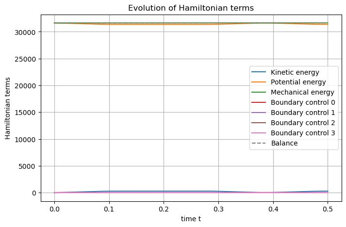

The shallow water equation
==========================

.. _Shallow_water_2D:

.. automodule:: scrimp.examples.shallow_water
   :members:
   :undoc-members:
   :show-inheritance:

The objective of this example is to show how to deal with
**non-linearity**.

Let us consider a bounded domain :math:`\Omega \subset \mathbb{R}^2`.
The shallow water equations are constituted of two conservation laws

.. math::

       \begin{pmatrix}
       \partial_t h \\ \partial_t p
       \end{pmatrix} 
       = \begin{bmatrix}
       0 & - {\rm div} \\
       -{\rm grad} & \frac{1}{h} G(\omega) 
       \end{bmatrix}
       \begin{pmatrix}
       {e}_h \\ {e_p}
       \end{pmatrix} ,

where :math:`h` is the height of the fluid, :math:`v` is the velocity,
:math:`\rho` is the fluid density (supposed constant),
:math:`p := \rho v` is the linear momentum,
:math:`\omega := {\rm curl}_{2D} \left( v \right) := \partial_x v_y - \partial_y v_x`
is the vorticity,
:math:`G(\omega):=\rho \begin{bmatrix} 0 & 1 \\ -1 & 0 \end{bmatrix}\,{\omega}`,
:math:`e_h = \frac{1}{2} \rho\,\|v\|^2 + \rho g h` is the total pressure
and :math:`e_p = h v` is the volumetric flow of the fluid. Thus, the
first line of the matrix equation represents the conservation of the
mass (or volume, since the fluid is assumed to be incompressible) and
the second represents the conservation of linear momentum.

Port-Hamiltonian framework
--------------------------

One can define the system Hamiltonian (or total energy) as a functional
of :math:`h` and :math:`p`, which are thus called energy variables

.. math::

       \mathcal{H} (h,p) := \frac{1}{2} \int_\Omega \frac{h(t,x) \| p(t,x) \|^2}{\rho} + \rho g h^2(t,x) {\rm d}x.

The co-energy variables can be computed from the variational derivative
of the Hamiltonian such that

.. math::

       \begin{split}
           e_h & = \delta_h \mathcal{H} = \frac{1}{2} \rho \| v \|^2 +  \rho g h , \\
           e_p & = \delta_{p} \mathcal{H} = h v .
       \end{split}

The time-derivative of the Hamiltonian can then be obtained computed and
depends only on the boundary variables

.. math::

        \frac{\rm d}{{\rm d}t} \mathcal{H} =  - \int_{\partial\Omega} e_h(t,s) e_p(t,s) \cdot n(s) {\rm d}s ,

which enables to define collocated control and observation distributed
ports along the boundary :math:`\partial\Omega`. For example, one may
define

.. math::

      \begin{split}
           u_{\partial} & = - e_p \cdot n,\\
           y_{\partial} & = e_h,
       \end{split}

and the power-balance is given by a product between input and output
boundary ports. The system is lossless, and conservative in the absence
of control.

Structure-preserving discretization
-----------------------------------

First, let us multiply the linear momentum conservation equation by
:math:`h`.

Let us consider sufficiently regular test functions :math:`\varphi` and
:math:`\Phi` on :math:`\Omega`, and :math:`\psi` test functions at the
boundary :math:`\partial\Omega`. The weak form of the previous equations
reads

.. math::

       \left\lbrace
       \begin{array}{rcl}
       \left( \partial_t h, \varphi \right)_{L^2} &=& - \left( {\rm div}\left( h e_p \right), \varphi \right)_{L^2}, \\
       \left( h \partial_t p, \Phi \right)_{(L^2)^2} &=& - \left( h {\rm grad}\left( e_h \right), \Phi \right)_{(L^2)^2}
                               + \left( {\rm curl}_{2D}\left( p \right) \begin{bmatrix} 0 & 1 \\ -1 & 0 \end{bmatrix} e_p, \Phi \right)_{(L^2)^2}, \\
       \left( y_\partial, \psi \right)_{\partial\Omega} &=& \left( e_h, \psi \right)_{\partial\Omega}.
       \end{array}
       \right.

Applying integration by parts on the first line leads to

.. math::

       \left\lbrace
       \begin{array}{rcl}
       \left( \partial_t h, \varphi \right)_{L^2} &=& \left( h e_p, {\rm grad} \left( \varphi \right) \right)_{L^2} + \left( h u_\partial, \varphi \right)_{\partial\Omega}, \\
       \left( h \partial_t p, \Phi \right)_{(L^2)^2} &=& - \left( h {\rm grad} \left( e_h \right), \Phi \right)_{(L^2)^2}
                               + \left( {\rm curl}_{2D}\left( p \right) \begin{bmatrix} 0 & 1 \\ -1 & 0 \end{bmatrix} e_p, \Phi \right)_{(L^2)^2}, \\
       \left( y_\partial, \psi \right)_{\partial\Omega} &=& \left( e_h, \psi \right)_{\partial\Omega}.
       \end{array}
       \right.

Furthermore, the weak form of the constitutive relations write

.. math::

       \left\lbrace
       \begin{array}{rcl}
       \left( e_h, \varphi \right)_{L^2} &=& \left( \rho g h, \varphi \right)_{L^2} + \left( \frac{\| p \|^2}{2 \rho}, \varphi \right)_{L^2}, \\
       \left( e_p, \Phi \right)_{(L^2)^2} &=& \left( \frac{p}{\rho}, \Phi \right)_{(L^2)^2}.
       \end{array}
       \right.

Now, let us choose three finite families
:math:`(\varphi^i)_{1 \le i \le N_h} \subset H^1(\Omega)`,
:math:`(\Phi^k)_{1 \le k \le N_p} \subset (L^2(\Omega))^2` and
:math:`(\psi^m)_{1 \le m \le N_\partial}` and project the weak
formulations on them: for all :math:`1 \le i \le N_h`, all
:math:`1 \le k \le N_p` and all :math:`1 \le m \le N_\partial`

.. math::

       \left\lbrace
       \begin{array}{rcl}
       \sum_{j=1}^{N_h} \frac{\rm d}{{\rm d}t} h^j \left( \varphi^j, \varphi^i \right)_{L^2} &=& \sum_{\ell=1}^{N_p} e_p^\ell \left( h^d \Phi^\ell, {\rm grad} \left( \varphi^i \right) \right)_{L^2} + \sum_{n=1}^{N_\partial} u_\partial^n \left( h^d \psi^n, \varphi^i \right)_{\partial\Omega}, \\
       \sum_{\ell=1}^{N_p} \frac{\rm d}{{\rm d}t} p^\ell \left( h^d \Phi^\ell, \Phi^k \right)_{(L^2)^2} &=& - \sum_{j=1}^{N_h} e_h^j \left( h^d {\rm grad} \left( \varphi^j \right), \Phi^k \right)_{(L^2)^2} \\
                              && \quad + \sum_{\ell=1}^{N_p} e_p^\ell \left( {\rm curl}_{2D}\left( p^d \right) \begin{bmatrix} 0 & 1 \\ -1 & 0 \end{bmatrix} \Phi^\ell, \Phi^k \right)_{(L^2)^2}, \\
       \sum_{n=1}^{N_\partial} y_\partial^n \left( \psi^n, \psi^m \right)_{\partial\Omega} &=& \sum_{j=1}^{N_h} e_h^j \left( \varphi^j, \psi^m \right)_{\partial\Omega},
       \end{array}
       \right.

where :math:`h^d := \sum_{i=1}^{N_h} h^i \varphi^i` is the approximation
of :math:`h` and :math:`p^d := \sum_{k=1}^{N_p} p^k \Phi^k` is the
approximation of :math:`p`. The constitutive relations read for all
:math:`1 \le i \le N_h` and all :math:`1 \le k \le N_p`

.. math::

       \left\lbrace
       \begin{array}{rcl}
       \sum_{j=1}^{N_h} e_h^j \left( \varphi^j, \varphi^i \right)_{L^2} &=& \sum_{j=1}^{N_h} h^j \left( \rho g \varphi^j, \varphi^i \right)_{L^2} + \sum_{\ell=1}^{N_p} p^\ell \left( \frac{\Phi^\ell \cdot p^d}{2 \rho}, \varphi^i \right)_{L^2}, \\
       \sum_{\ell=1}^{N_p} e_p^\ell \left( \Phi^\ell, \Phi^k \right)_{(L^2)^2} &=& \sum_{\ell=1}^{N_p} p^\ell \left( \frac{\Phi^\ell}{\rho}, \Phi^k \right)_{(L^2)^2}.
       \end{array}
       \right.

Defining :math:`\underline{\star}` the vector gathering the coefficient
of the approximation of the variable :math:`\star` in its appropriate
finite family, one may write the discrete weak formulations in matrix
notation

.. math::

       \begin{bmatrix} M_h & 0 & 0 \\ 0 & M_p[h^d] & 0 \\ 0 & 0 & M_\partial \end{bmatrix} \begin{pmatrix} \underline{h} \\ \underline{p} \\ -\underline{y_\partial} \end{pmatrix}
       =
       \begin{bmatrix}
       0 & D[h^d] & B[h^d] \\
       -D[h^d]^\top & G[p^d] & 0 \\
       - B^\top & 0 & 0
       \end{bmatrix}
       \begin{pmatrix} \underline{e_h} \\ \underline{e_p} \\ \underline{u_\partial} \end{pmatrix}.

where the matrices are given by

.. math::

       (M_h)_{ij} := \left( \varphi^j, \varphi^i \right)_{L^2} \qquad (M_p[h^d])_{k\ell} := \left( h^d \Phi^\ell, \Phi^k \right)_{(L^2)^2},

.. math::

       (D[h^d])_{i\ell} := \left( h^d \Phi^\ell, {\rm grad} \left( \varphi^i \right) \right)_{L^2}, \qquad (B[h^d])_{in} := \left( h^d \psi^n, \varphi^i \right)_{\partial\Omega},

and

.. math::
       
       
       (M_\partial)_{mn} := \left( \psi^n, \psi^m \right)_{\partial\Omega}, \qquad (B)_{in} := \left( \psi^n, \varphi^i \right)_{\partial\Omega}.

The constitutive relations read

.. math::

       \begin{bmatrix} M_h & 0 \\ 0 & M_p \end{bmatrix} \begin{pmatrix} \underline{e_h} \\ \underline{e_p} \end{pmatrix}
       =
       \begin{bmatrix}
       Q_h & P_h[h^d] \\
       0 & Q_p
       \end{bmatrix}
       \begin{pmatrix} \underline{h} \\ \underline{p} \end{pmatrix},

where the matrices are given by

.. math::

       (M_p)_{k\ell} := \left( \Phi^\ell, \Phi^k \right)_{(L^2)^2}, \qquad (Q_h)_{ij} := \left( \rho g \varphi^j, \varphi^i \right)_{L^2},

.. math::
       
       
       (P_h[h^d])_{i\ell} := \left( \frac{\Phi^\ell \cdot p^d}{2 \rho}, \varphi^i \right)_{L^2}, \qquad (Q_d)_{k\ell} := \left( \frac{\Phi^\ell}{\rho}, \Phi^k \right)_{(L^2)^2}.

With these definition, one may prove the **discrete power balance**

.. math::

       \frac{\rm d}{{\rm d}t} \mathcal{H}^d(t) = \underline{u_\partial}^\top(t) M_\partial \underline{y_\partial}(t).

Simulation
----------

The beggining is classical: first import, then create the dphs and set
the domain.

.. code:: python

    # Import scrimp
    import scrimp as S
    
    # Init the distributed port-Hamiltonian system
    swe = S.DPHS("real")
    
    # Set the domain (using the built-in geometry `Rectangle`)
    # Labels: Omega = 1, Gamma_Bottom = 10, Gamma_Right = 11, Gamma_Top = 12, Gamma_Left = 13
    swe.set_domain(S.Domain("Rectangle", {"L": 2.0, "l": 0.5, "h": 0.1}))

Then the states and co-states.

.. code:: python

    # Define the states and costates
    states = [
        S.State("h", "Fluid height", "scalar-field"),
        S.State("p", "Linear momentum", "vector-field"),
    ]
    costates = [
        S.CoState("e_h", "Pressure", states[0]),
        S.CoState("e_p", "Velocity", states[1]),
    ]
    
    # Add them to the dphs
    for state in states:
        swe.add_state(state)
    for costate in costates:
        swe.add_costate(costate)

And the control ports.

.. code:: python

    # Define the control ports
    control_ports = [
        S.Control_Port(
            "Boundary control 0",
            "U_0",
            "Normal velocity",
            "Y_0",
            "Fluid height",
            "scalar-field",
            region=10,
            position="effort",
        ),
        S.Control_Port(
            "Boundary control 1",
            "U_1",
            "Normal velocity",
            "Y_1",
            "Fluid height",
            "scalar-field",
            region=11,
            position="effort",
        ),
        S.Control_Port(
            "Boundary control 2",
            "U_2",
            "Normal velocity",
            "Y_2",
            "Fluid height",
            "scalar-field",
            region=12,
            position="effort",
        ),
        S.Control_Port(
            "Boundary control 3",
            "U_3",
            "Normal velocity",
            "Y_3",
            "Fluid height",
            "scalar-field",
            region=13,
            position="effort",
        ),
    ]
    
    # Add them to the dphs
    for ctrl_port in control_ports:
        swe.add_control_port(ctrl_port)

Regarding the FEM, this is more challenging, as non-linearity are
present. Nevertheless, let us stick to the way we choose until now:
since the :math:`h`-type variables will be derivated, thus we choose
continuous Galerkin approximations of order :math:`k+1`. The other
variables are taken as discontinuous Galerkin approximations of order
:math:`k`.

.. code:: python

    # Define the Finite Elements Method of each port
    k = 1
    FEMs = [
        S.FEM(states[0].get_name(), k+1, FEM="CG"),
        S.FEM(states[1].get_name(), k, FEM="CG"),
        S.FEM(control_ports[0].get_name(), k, "DG"),
        S.FEM(control_ports[1].get_name(), k, "DG"),
        S.FEM(control_ports[2].get_name(), k, "DG"),
        S.FEM(control_ports[3].get_name(), k, "DG"),
    ]
    
    # Add them to the dphs
    for FEM in FEMs:
        swe.add_FEM(FEM)

The parameters are *physically meaningful*!

.. code:: python

    # Define physical parameters
    rho = 1000.
    g = 10.
    parameters = [
        S.Parameter("rho", "Mass density", "scalar-field", f"{rho}", "h"),
        S.Parameter("g", "Gravity", "scalar-field", f"{g}", "h"),
    ]
    
    # Add them to the dphs
    for parameter in parameters:
        swe.add_parameter(parameter)

Here are the difficult part. We need to define the weak form of each
block matrices, and take non-linearities into account. To do so, the
GFWL of GetFEM is transparent, but it is mandatory to say to **SCRIMP**
that the ``Brick`` is non-linear, using the keyword ``linear=False``. It
is also possible to ask for this block to be considered *explicitly* in
the time scheme (*i.e.* it will be computed with the previous time step
values and be considered as a right-hand side), as done for the
gyroscopic term below, using the keyword ``explicit=True``.

.. code:: python

    # Define the pHs via `Brick` == non-zero block matrices == variational terms
    # Some macros for the sake of readability
    swe.gf_model.add_macro('div(v)', 'Trace(Grad(v))')
    swe.gf_model.add_macro('Rot', '[[0,1],[-1,0]]')
    swe.gf_model.add_macro('Curl2D(v)', 'div(Rot*v)')
    swe.gf_model.add_macro('Gyro(v)', 'Curl2D(v)*Rot')
    bricks = [
        # Define the mass matrices of the left-hand side of the "Dirac structure" (position="flow")
        S.Brick("M_h", "h * Test_h", [1], dt=True, position="flow"),
        S.Brick("M_p", "h * p . Test_p", [1], dt=True, linear=False, position="flow"),
        S.Brick("M_Y_0", "Y_0 * Test_Y_0", [10], position="flow"),
        S.Brick("M_Y_1", "Y_1 * Test_Y_1", [11], position="flow"),
        S.Brick("M_Y_2", "Y_2 * Test_Y_2", [12], position="flow"),
        S.Brick("M_Y_3", "Y_3 * Test_Y_3", [13], position="flow"),
    
        # Define the first line of the right-hand side of the "Dirac structure" (position="effort")
        S.Brick("-D^T", "h * e_p . Grad(Test_h)", [1], linear=False, position="effort"),
        # with the boundary control
        S.Brick("B_0", "- U_0 * Test_h", [10], position="effort"),
        S.Brick("B_1", "- U_1 * Test_h", [11], position="effort"),
        S.Brick("B_2", "- U_2 * Test_h", [12], position="effort"),
        S.Brick("B_3", "- U_3 * Test_h", [13], position="effort"),
        # Define the second line of the right-hand side of the "Dirac structure" (position="effort")
        S.Brick("D", "- Grad(e_h) . Test_p * h", [1], linear=False, position="effort"),
        # with the gyroscopic term (beware that "Curl" is not available in the GWFL of getfem)
        S.Brick("G", "(Gyro(p) * e_p) . Test_p", [1], linear=False, explicit=True, position="effort"),
        # Define the third line of the right-hand side of the "Dirac structure" (position="effort")
        S.Brick("C_0", "- e_h * Test_Y_0", [10], position="effort"),
        S.Brick("C_1", "- e_h * Test_Y_1", [11], position="effort"),
        S.Brick("C_2", "- e_h * Test_Y_2", [12], position="effort"),
        S.Brick("C_3", "- e_h * Test_Y_3", [13], position="effort"),
    
        ## Define the constitutive relations (position="constitutive", the default value)
        # For e_h: first the mass matrix WITH A MINUS because we want an implicit formulation 0 = - M e_h + F(h)
        S.Brick("-M_e_h", "- e_h * Test_e_h", [1]),
        # second the linear part as a linear brick
        S.Brick("Q_h", "rho * g * h * Test_e_h", [1]),
        # third the non-linear part as a non-linear brick (linear=False)
        S.Brick("P_h", "0.5 * (p . p) / rho * Test_e_h", [1], linear=False),
        # For e_p: first the mass matrix WITH A MINUS because we want an implicit formulation 0 = - M e_p + F(p)
        S.Brick("-M_e_p", "- e_p . Test_e_p", [1]),
        # second the LINEAR brick
        S.Brick("Q_p", "p / rho . Test_e_p", [1]),
    ]
    for brick in bricks:
        swe.add_brick(brick)

As we just look at how it works, let us consider a step in the height,
no initial velocity, and homogeneous Neumann boundary condition. This
should look like a dam break experiment in a rectangular tank.

**Remark:** note the use of ``np``, *i.e.* numpy, in the definition of
the initial height :math:`h_0`.

.. code:: python

    ## Initialize the problem
    swe.set_control("Boundary control 0", "0.")
    swe.set_control("Boundary control 1", "0.")
    swe.set_control("Boundary control 2", "0.")
    swe.set_control("Boundary control 3", "0.")
    
    # Set the initial data
    swe.set_initial_value("h", "3. - (np.sign(x-0.5)+1)/3.")
    swe.set_initial_value("p", f"[ 0., 0.]")
    
    ## Solve in time
    # Define the time scheme
    swe.set_time_scheme(
        ts_type="bdf",
        ts_bdf_order=4,
        t_f=0.5,
        dt=0.0001,
        dt_save=0.01,
    )
    
    # Solve the system in time
    swe.solve()

The Hamiltonian are then defined, computed, and shown.

.. code:: python

    ## Post-processing
    # Set Hamiltonian's name
    swe.hamiltonian.set_name("Mechanical energy")
    # Define Hamiltonian terms
    terms = [
        S.Term("Kinetic energy", "0.5*h*p.p/rho", [1]),
        S.Term("Potential energy", "0.5*rho*g*h*h", [1]),
    ]
    # Add them to the Hamiltonian
    for term in terms:
        swe.hamiltonian.add_term(term)
    # Plot the Hamiltonian
    swe.plot_Hamiltonian(save_figure=True, filename="Hamiltonian_Inviscid_Shallow_Water_2D.png")

