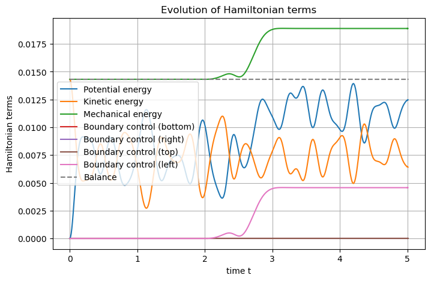
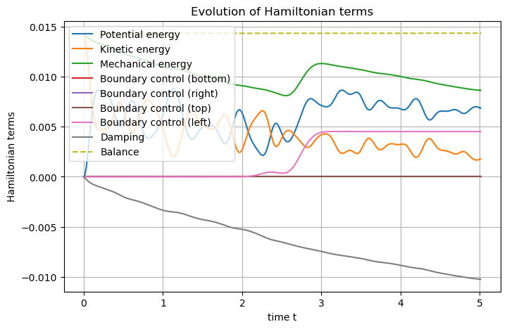

The wave equation
=================

.. _Wave_2D:

.. automodule:: examples.wave
   :members:
   :undoc-members:
   :show-inheritance:

Let us consider the 2D wave equation with *mixed* boundary controls on a
bounded rectangle :math:`\Omega := (0, L) \times (0, \ell)`, with boundaries
:math:`\Gamma_N := \left( (0, L) \times \{ 0, \ell \} \right) \cup \left( \{ L \} \times (0, \ell) \right)` and :math:`\Gamma_D := \{ 0 \} \times (0, \ell)`.

The deflection of the membrane from the equilibrium :math:`w` satisfies
classicaly

.. math::

       \left\lbrace
       \begin{array}{rcl}
       \rho(x) \partial_{tt}^2 w(t,x) - {\rm div} \left( T(x) \cdot {\rm grad} \left( w(t,x) \right) \right) &=& 0, \qquad t \ge 0, x \in \Omega, \\
       \partial_t w(0,x) &=& v_0(x), \qquad x \in \Omega, \\
       \partial_x w(0,x) &=& s_0(x), \qquad x \in \Omega, \\
       T(s) \cdot {\rm grad} \left( w(t,s) \right) &=& u_N(t,s), \qquad t \ge 0, s \in \Gamma_N, \\
       \partial_t w(t,s) &=& u_D(t,s), \qquad t \ge 0, s \in \Gamma_D,
       \end{array}
       \right.

where :math:`\rho` is the mass density and :math:`T` the Young’s
modulus. The subscript :math:`N` stands for **Neumann**, while the
subscript :math:`D` stands for **Dirichlet** (to be fair, this is not
really a Dirichlet boundary condition, as it imposes
:math:`\partial_t w` and not :math:`w` at the boundary
:math:`\Gamma_D`).

Let us state the physics in the port-Hamiltonian formalism.

Port-Hamiltonian framework
--------------------------

Let :math:`\alpha_q := {\rm grad} w` denotes the *strain* and
:math:`\alpha_p := \rho \partial_t w` the *linear momentum*. One can
express the total mechanical energy lying in the system
:math:`\mathcal{H}`, the **Hamiltonian**, as

.. math::

       \mathcal{H}(t) = \mathcal{H}(\alpha_q(t,x), \alpha_p(t,x)) := \underbrace{\frac{1}{2} \int_\Omega \alpha_q(t,x) \cdot T(x) \cdot \alpha_q(t,x) {\rm d}x}_{\text{Potential energy}} + \underbrace{\frac{1}{2} \int_\Omega \frac{\alpha_p(t,x)^2}{\rho(x)} {\rm d}x}_{\text{Kinetic energy}}.

The **co-energy variables** are, as in the 1D case

.. math::

       e_q := \delta_{\alpha_q} \mathcal{H} = T \cdot \alpha_q, \qquad e_p := \delta_{\alpha_p} \mathcal{H} = \frac{\alpha_p}{\rho},

that is the *stress* and the *velocity* respectively.

Newton’s second law and Schwarz’s lemma give the following dynamics

.. math::

       \begin{pmatrix} \partial_t \alpha_q \\ \partial_t \alpha_p \end{pmatrix}
       =
       \begin{bmatrix} 0 & {\rm grad} \\ {\rm div} & 0 \end{bmatrix}
       \begin{pmatrix} e_q \\ e_p \end{pmatrix}.

Of course, this system allows to recover the initial wave equation in
second-order form.

The port-Hamiltonian system representing a (linear) vibrating membrane
with mixed boundary controls then writes

.. math::

       \begin{pmatrix} \partial_t \alpha_q \\ \partial_t \alpha_p \end{pmatrix}
       =
       \begin{bmatrix} 0 & {\rm grad} \\ {\rm div} & 0 \end{bmatrix}
       \begin{pmatrix} e_q \\ e_p \end{pmatrix},

.. math::

       \left\lbrace
       \begin{array}{rcl}
       e_q(t,s) &=& u_N(t,s), \qquad t \ge 0, s \in \Gamma_N, \\
       e_p(t,s) &=& u_D(t,s), \qquad t \ge 0, s \in \Gamma_D, \\
       y_N(t,s) &=& e_p(t,s), \qquad t \ge 0, s \in \Gamma_N, \\
       y_D(t,s) &=& e_q(t,s), \qquad t \ge 0, s \in \Gamma_D,
       \end{array}
       \right.

.. math::

       \left\lbrace
       \begin{array}{rcl}
       e_q &=& T \cdot \alpha_q, \\
       e_p &=& \frac{\alpha_p}{\rho}.
       \end{array}
       \right.

The **power balance** satisfied by the **Hamiltonian** is

.. math::

       \frac{\rm d}{{\rm d}t} \mathcal{H}(t) = \underbrace{\left\langle y_N(t,\cdot), u_N(t,\cdot)\right\rangle_{\Gamma_N}}_{\text{power flowing through }\Gamma_N} + \underbrace{\left\langle u_D(t,\cdot), y_D(t,\cdot) \right\rangle_{\Gamma_D}}_{\text{power flowing through }\Gamma_D},

where :math:`\left\langle \cdot, \cdot \right\rangle_{\Gamma}` is a
boundary duality bracket :math:`H^\frac12, H^{-\frac12}` at the boundary
:math:`\Gamma`.

Structure-preserving discretization
-----------------------------------

Let :math:`\varphi_q` and :math:`\varphi_p` be smooth test functions on
:math:`\Omega`, and :math:`\psi_N` and :math:`\psi_D` be smooth test
functions on :math:`\Gamma_N` and :math:`\Gamma_D` respectively. One can
write the weak formulation of the **Dirac Structure** as follows

.. math::
    :label: weak-form

       \left\lbrace
       \begin{array}{rcl}
       \int_\Omega \partial_t \alpha_q(t,x) \varphi_q(x) {\rm d}x &=& \int_\Omega {\rm grad} \left( e_p(t,x) \right) \cdot \varphi_q(x) {\rm d}x, \\
       \int_\Omega \partial_t \alpha_p(t,x) \varphi_p(x) {\rm d}x &=& \int_\Omega {\rm div} \left( e_q(t,x) \right) \varphi_p(x) {\rm d}x, \\
       \left\langle y_N, \psi_N \right\rangle_{\Gamma_N} &=& \left\langle e_p, \psi_N \right\rangle_{\Gamma_N}, \\
       \left\langle u_D, \psi_D \right\rangle_{\Gamma_D} &=& \left\langle e_p, \psi_D \right\rangle_{\Gamma_D}.
       \end{array}
       \right.

Integrating by parts the second line make the control :math:`u_N` and
the observation :math:`y_D` appear

.. math::

       \int_\Omega \partial_t \alpha_p(t,x) \varphi_p(x) {\rm d}x = - \int_\Omega e_q(t,x) \cdot {\rm grad} \left( \varphi_p(x) \right) {\rm d}x + \left\langle \varphi_p, u_N \right\rangle_{\Gamma_N} + \left\langle \varphi_p, y_D \right\rangle_{\Gamma_D}.

Now, let :math:`(\varphi_q^i)_{1 \le i \le N_q} \subset L^2(\Omega)` and
:math:`(\varphi_p^k)_{1 \le k \le N_p} \subset H^1(\Omega)` be two
finite families of approximations for the :math:`q`-type port and the
:math:`p`-type port respectively, typically discontinuous and continuous
Galerkin finite elements respectively. Denote also
:math:`(\psi_N^m)_{1 \le m_N \le N_N} \subset H^{\frac12}(\Gamma_N)` and
:math:`(\psi_D^m)_{1 \le m_D \le N_D} \subset H^{\frac12}(\Gamma_D)`. In
particular, the latter choices imply that the duality brackets at the
boundary reduce to simple :math:`L^2` scalar products.

Writing the discrete weak formulation with those families, one has for
all :math:`1 \le i \le N_q`, all :math:`1 \le k \le N_p`, all
:math:`1 \le m_N \le N_N` and all :math:`1 \le m_D \le N_D`

.. math::
    :label: weak-form-IBP

       \left\lbrace
       \begin{array}{rcl}
       \sum_{j=1}^{N_q} \int_\Omega \varphi_q^j(x) \varphi_q^i(x) {\rm d}x \, \frac{\rm d}{{\rm d}t} \alpha_q^j(t) &=& \sum_{\ell=1}^{N_p} \int_\Omega {\rm grad} \left( \varphi_p^\ell(x) \right) \cdot \varphi_q^i(x) {\rm d}x \, e_p^\ell(t), \\
       \sum_{\ell=1}^{N_p} \int_\Omega \varphi_p^\ell(x) \varphi_p^k(x) {\rm d}x \, \frac{\rm d}{{\rm d}t} \alpha_p^\ell(t) &=& - \sum_{j=1}^{N_q} \int_\Omega \varphi_q^j(x) \cdot {\rm grad} \left( \varphi_p^k(x) \right) {\rm d}x \, e_q^j(t) \\
       && \quad + \sum_{n_N=1}^{N_N} \int_{\Gamma_N} \varphi_p^k(s) \psi_N^{n_N}(s) {\rm d}s \, u_N^{n_N}(t) \\
       && \qquad + \sum_{n_D=1}^{N_D} \int_{\Gamma_D} \varphi_p^k(s) \psi_D^{n_D}(s) {\rm d}s \, y_D^{n_D}(t), \\
       \sum_{n_N=1}^{N_N} \left\langle \psi_N^{n_N}, \psi_N^{m_N} \right\rangle_{\Gamma_N} \, y_N^{n_N}(t) &=& \sum_{\ell=1}^{N_p} \int_{\Gamma_N} \varphi_p^\ell(s) \psi_N^{m_N}(s) {\rm d}s \, e_p^\ell(t), \\
       \sum_{n_D=1}^{N_D} \left\langle \psi_D^{n_D}, \psi_D^{m_D} \right\rangle_{\Gamma_D} \, u_D^{n_D}(t) &=& \sum_{\ell=1}^{N_p} \int_{\Gamma_D} \varphi_p^\ell(s) \psi_D^{m_D}(s) {\rm d}s \, e_p^\ell(t),
       \end{array}
       \right.

which rewrites in matrix form

.. math::

       \underbrace{\begin{bmatrix}
       M_q & 0 & 0 & 0 \\
       0 & M_p & 0 & 0 \\
       0 & 0 & M_N & 0 \\
       0 & 0 & 0 & M_D
       \end{bmatrix}}_{= M}
       \begin{pmatrix}
       \frac{\rm d}{{\rm d}t} \underline{\alpha_q}(t) \\
       \frac{\rm d}{{\rm d}t} \underline{\alpha_p}(t) \\
       -\underline{y_N}(t) \\
       \underline{u_D}(t)
       \end{pmatrix}
       =
       \underbrace{\begin{bmatrix}
       0 & D & 0 & 0 \\
       -D^\top & 0 & B_N & -B_D^T \\
       0 & -B_N^\top & 0 & 0 \\
       0 & B_D & 0 & 0
       \end{bmatrix}}_{= J}
       \begin{pmatrix}
       \underline{e_q}(t) \\
       \underline{e_p}(t) \\
       \underline{u_N}(t) \\
       -\underline{y_D}(t)
       \end{pmatrix},

where
:math:`\underline{\star}(t) := \begin{pmatrix} \star^1(t) & \cdots & \star^{N_\star} \end{pmatrix}^\top`
and

.. math::
    :label: weak-form-matrices-1

       (M_q)_{ij} := \int_\Omega \varphi_q^j(x) \cdot \varphi_q^i(x) {\rm d}x,
       \qquad
       (M_p)_{k\ell} := \int_\Omega \varphi_p^\ell(x) \varphi_p^k(x) {\rm d}x,

.. math::
    :label: weak-form-matrices-2

       (M_N)_{m_Nn_N} := \int_{\Gamma_N} \psi_N^{n_N}(s) \psi_N^{m_N}(s) {\rm d}s,
       \qquad
       (M_D)_{m_Dn_D} := \int_{\Gamma_D} \psi_D^{n_D}(s) \psi_D^{m_D}(s) {\rm d}s,

.. math::

       (D)_{i\ell} := \int_\Omega {\rm grad} \left( \varphi_p^\ell(x) \right) \cdot \varphi_q^i(x) {\rm d}x,

.. math::

       (B_N)_{n_Nk} := \int_{\Gamma_N} \varphi_p^k(s) \psi_N^{n_N}(s) {\rm d}s,
       \qquad
       (B_D)_{m_D\ell} := \int_{\Gamma_D} \varphi_p^\ell(s) \psi_D^{m_D}(s) {\rm d}s,

Now one can approximate the **constitutive relations** in those families
by projection of their weak formulations

.. math::

       \left\lbrace
       \begin{array}{rcl}
       \int_\Omega e_q(t,x) \cdot \varphi_q(x) {\rm d}x &=& \int_\Omega \alpha_q(t,x) \cdot T(x) \cdot \varphi_q(x) {\rm d}x, \\
       \int_\Omega e_p(t,x) \varphi_p(x) {\rm d}x &=&  \int_\Omega \frac{\alpha_p(t,x)}{\rho(x)} \varphi_p(x) {\rm d}x,
       \end{array}
       \right.

from which one can deduce the matrix form of the discrete weak
formulation of the constitutive relation

.. math::

       \left\lbrace
       \begin{array}{rcl}
       M_q \underline{e_q}(t) &=& M_T \underline{\alpha_q}(t), \\
       M_p \underline{e_p}(t) &=& M_\rho \underline{\alpha_p}(t),
       \end{array}
       \right.

where

.. math::
    :label: weak-form-matrices-3

       (M_T)_{ij} := \int_\Omega \varphi_q^j(x) \cdot T(x) \cdot \varphi_q^i(x) {\rm d}x,
       \qquad
       (M_\rho)_{k\ell} := \int_\Omega \frac{\varphi_p^\ell(x)}{\rho(x)} \varphi_p^k(x) {\rm d}x.

Finally, the **discrete Hamiltonian** :math:`\mathcal{H}^d` is defined
as the evaluation of :math:`\mathcal{H}` on the approximation of the
**state variables**

.. math::

       \mathcal{H}^d(t) := \mathcal{H}(\alpha_q^d(t,x), \alpha_p^d(t)) = \frac{1}{2} \underline{\alpha_q}(t)^\top M_T \underline{\alpha_q}(t) + \frac{1}{2} \underline{\alpha_p}(t)^\top M_\rho \underline{\alpha_p}(t). 

The **discrete power balance** is then easily deduced from the above
matrix formulations, thanks to the symmetry of :math:`M` and the
skew-symmetry of :math:`J`

.. math::

       \frac{\rm d}{{\rm d}t} \mathcal{H}^d(t) = \underline{y_N}(t)^\top M_N \underline{u_N}(t) + \underline{u_D}(t)^\top M_D \underline{y_D}(t).

Simulation
----------

Let us start by importing the scrimp package

.. code:: python

    # Import scrimp
    import scrimp as S

Now define a real Distributed Port-Hamiltonian System

.. code:: python

    # Init the distributed port-Hamiltonian system
    wave = S.DPHS("real")

The domain is 2-dimensional, and is a rectangle of length 2 and width 1.
We use the built-in geometry ``Rectangle`` and choose a mesh size
parameter of 0.1 with the following command.

.. code:: python

    # Set the domain (using the built-in geometry `Rectangle`)
    # Labels: Omega = 1, Gamma_Bottom = 10, Gamma_Right = 11, Gamma_Top = 12, Gamma_Left = 13
    rectangle = S.Domain("Rectangle", {"L": 2.0, "l": 1.0, "h": 0.1})
    
    # And add it to the dphs
    wave.set_domain(rectangle)

Defining the states and co-states, care must be taken: the Strain is a
**vector-field**.

.. code:: python

    # Define the variables and their discretizations
    states = [
        S.State("q", "Strain", "vector-field"),
        S.State("p", "Linear momentum", "scalar-field"),
    ]
    costates = [
        S.CoState("e_q", "Stress", states[0]),
        S.CoState("e_p", "Velocity", states[1]),
    ]
    
    # Add them to the dphs
    for state in states:
        wave.add_state(state)
    for costate in costates:
        wave.add_costate(costate)

As the domain is the built-in geometry ``Rectangle``, the boundary is
composed of four parts, with indices 10, 11, 12 and 13, respectively for
the lower, right, upper and left edge. Each of them will have its own
control port, allowing *e.g.* **mixed** boundary conditions.

Indeed in the above example, we choose Neumann boundary condition on
:math:`\Gamma_N`, *i.e.* on 10, 11 and 12, while we choose Dirichlet
boundary condition on :math:`\Gamma_D`, *i.e.* on 13.

The choice to integrate by part the second line of :eq:`weak-form` has
a consequence for the port at boundary 13, as it is then in the *flow*
part of the Dirac structure, as can be seen in :eq:`weak-form-IBP`. We
indicate this using the keyword ``position="flow"``.

.. code:: python

    # Define the control ports
    control_ports = [
        S.Control_Port(
            "Boundary control (bottom)",
            "U_B",
            "Normal force",
            "Y_B",
            "Velocity trace",
            "scalar-field",
            region=10,
        ),
        S.Control_Port(
            "Boundary control (right)",
            "U_R",
            "Normal force",
            "Y_R",
            "Velocity trace",
            "scalar-field",
            region=11,
        ),
        S.Control_Port(
            "Boundary control (top)",
            "U_T",
            "Normal force",
            "Y_T",
            "Velocity trace",
            "scalar-field",
            region=12,
        ),
        S.Control_Port(
            "Boundary control (left)",
            "U_L",
            "Velocity trace",
            "Y_L",
            "Normal force",
            "scalar-field",
            region=13,
            position="flow",
        ),
    ]
    
    # Add them to the dphs
    for ctrl_port in control_ports:
        wave.add_control_port(ctrl_port)

The choice for the finite element families is often the first difficulty
of a simulation. Indeed, it can result in a failing time scheme, or a
very instable solution. A key-point to take a first decision is to
remember which field needs regularity (in the :math:`L^2`-sense) in the
Dirac structure. In our case, the :math:`p`-type variables should be at
least :math:`H^1(\Omega)`, as can be inferred from :eq:`weak-form-IBP`.
Hence, a first choice for the :math:`p`-type variables is to take
continuous Galerkin finite elements of order :math:`k`. Since the time
derivative of :math:`q` will be, more or less, a gradient of a
:math:`p`-type variable, it will be a discontinuous Galerkin of order
:math:`k-1` approximation. Finally, at least one trace of these
variables, either the control, or the observation, is at most a
discontinuous Galerkin of order :math:`k-1` approximation. Hence the
following choices, with :math:`k=2`.

.. code:: python

    # Define the Finite Elements Method of each port
    FEMs = [
        S.FEM(states[0].get_name(), 1, "DG"),
        S.FEM(states[1].get_name(), 2, "CG"),
        S.FEM(control_ports[0].get_name(), 1, "DG"),
        S.FEM(control_ports[1].get_name(), 1, "DG"),
        S.FEM(control_ports[2].get_name(), 1, "DG"),
        S.FEM(control_ports[3].get_name(), 1, "DG"),
    ]
    
    # Add them to the dphs
    for FEM in FEMs:
        wave.add_FEM(FEM)

We can assume anisotropy and heterogeneity in our model by defining the
parameters as follows. It has to be kept in mind that a parameter is
always linked to a port (*i.e.*, to a pair *flow-effort*). In
particular, a parameter linked to a port that is a vector-field, should
be a **tensor-field**.

.. code:: python

    # Define physical parameters
    parameters = [
        S.Parameter("T", "Young's modulus", "tensor-field", "[[5+x,x*y],[x*y,2+y]]", "q"),
        S.Parameter("rho", "Mass density", "scalar-field", "3-x", "p"),
    ]
    
    # Add them to the dphs
    for parameter in parameters:
        wave.add_parameter(parameter)

It is time to define the bricks of our model, *i.e.* the block matrices
of our discretization, providing the weak forms given in
:eq:`weak-form-matrices-1`, :eq:`weak-form-matrices-2`, and
:eq:`weak-form-matrices-3`.

This is probably the most difficult part of the process, and care must
be taken. Remember that the syntax is the Generic Weak-Form Language
(GWFL), for which an on-line documentation exists on the `GetFEM
site <https://getfem.org/userdoc/gasm_high.html?highlight=gwfl>`__.

For the block matrices appearing against time derivative of a variable,
it is crucial not to forget the keyword ``dt=True``.

.. code:: python

    # Define the pHs via `Brick` == non-zero block matrices == variational terms
    bricks = [
        ## Define the Dirac structure
        # Define the mass matrices from the left-hand side: the `flow` part of the Dirac structure
        S.Brick("M_q", "q.Test_q", [1], dt=True, position="flow"),
        S.Brick("M_p", "p*Test_p", [1], dt=True, position="flow"),
        S.Brick("M_Y_B", "Y_B*Test_Y_B", [10], position="flow"),
        S.Brick("M_Y_R", "Y_R*Test_Y_R", [11], position="flow"),
        S.Brick("M_Y_T", "Y_T*Test_Y_T", [12], position="flow"),
        # The Dirichlet term is applied via Lagrange multiplier == the colocated output
        S.Brick("M_Y_L", "U_L*Test_Y_L", [13], position="flow"),
        # Define the matrices from the right-hand side: the `effort` part of the Dirac structure
        S.Brick("D", "Grad(e_p).Test_q", [1], position="effort"),
        S.Brick("-D^T", "-e_q.Grad(Test_p)", [1], position="effort"),
        S.Brick("B_B", "U_B*Test_p", [10], position="effort"),
        S.Brick("B_R", "U_R*Test_p", [11], position="effort"),
        S.Brick("B_T", "U_T*Test_p", [12], position="effort"),
        # The Dirichlet term is applied via Lagrange multiplier == the colocated output
        S.Brick("B_L", "Y_L*Test_p", [13], position="effort"),
        S.Brick("C_B", "-e_p*Test_Y_B", [10], position="effort"),
        S.Brick("C_R", "-e_p*Test_Y_R", [11], position="effort"),
        S.Brick("C_T", "-e_p*Test_Y_T", [12], position="effort"),
        S.Brick("C_L", "-e_p*Test_Y_L", [13], position="effort"),
        ## Define the constitutive relations
        # Hooke's law under implicit form `- M_e_q e_q + CR_q q = 0`
        S.Brick("-M_e_q", "-e_q.Test_e_q", [1]),
        S.Brick("CR_q", "q.T.Test_e_q", [1]),
        # Linear momentum definition under implicit form `- M_e_p e_p + CR_p p = 0`
        S.Brick("-M_e_p", "-e_p*Test_e_p", [1]),
        S.Brick("CR_p", "p/rho*Test_e_p", [1]),
    ]
    
    # Add all these `Bricks` to the dphs
    for brick in bricks:
        wave.add_brick(brick)

The last step is to initialize the dphs, by providing the control
functions and the initial values for :math:`q` and :math:`p` (*i.e.*,
the variables that are derivated in time in the model).

.. code:: python

    ## Initialize the problem
    # The controls expression, ordered as the control_ports
    t_f = 5.0
    expressions = ["0.", "0.", "0.", f"0.1*sin(4.*t)*sin(4*pi*y)*exp(-10.*pow((0.5*{t_f}-t),2))"]
    
    # Add each expression to its control_port
    for control_port, expression in zip(control_ports, expressions):
        # Set the control functions: it automatically constructs the related `Brick`s such that `- M_u u + f(t) = 0`
        wave.set_control(control_port.get_name(), expression)
    
    # Set the initial data
    q_0 = "[0., 0.]"
    wave.set_initial_value("q", q_0)
    p_0 = "3**(-20*((x-0.5)*(x-0.5)+(y-0.5)*(y-0.5)))"
    wave.set_initial_value("p", p_0)

It remains to solve!

.. code:: python

    ## Solve in time
    # Define the time scheme ("cn" is Crank-Nicolson)
    wave.set_time_scheme(ts_type="cn",
                         t_f=t_f, 
                         dt_save=0.01,
                         )
    
    # Solve
    wave.solve()

Now we can set the Hamiltonian and plot it.

.. code:: python

    ## Post-processing
    # Set Hamiltonian's name
    wave.hamiltonian.set_name("Mechanical energy")
    # Define each Hamiltonian Term
    terms = [
        S.Term("Potential energy", "0.5*q.T.q", [1]),
        S.Term("Kinetic energy", "0.5*p*p/rho", [1]),
    ]
    # Add them to the Hamiltonian
    for term in terms:
        wave.hamiltonian.add_term(term)
    
    # Plot the Hamiltonian and save the output
    wave.plot_Hamiltonian(save_figure=True, filename="Hamiltonian_Wave_2D_Conservative.png")
    

Adding Damping to the dphs
--------------------------

The remining part of the notebook is focused on the way to deal with
*dissipativity*, hence using an **algebraic port**.

Let us come back to the continuous system. Adding a (fluid) damping
consists in an additive term in Newton second law, which is proportional
to the velocity (in the linear case). More precisely, denoting
:math:`\nu\ge0` the viscous parameter, one has:

.. math::

       \rho(x) \partial_{tt}^2 w(t,x) - {\rm div} \left( T(x) \cdot {\rm grad} \left( w(t,x) \right) \right) + \nu(x) \partial_t w(t,x) = 0.

Using the framework of port-Hamiltonian system, this rewrites:

.. math::

       \begin{pmatrix} \partial_t \alpha_q \\ \partial_t \alpha_p \end{pmatrix}
       =
       \begin{bmatrix} 0 & {\rm grad} \\ {\rm div} & 0 \end{bmatrix}
       \begin{pmatrix} e_q \\ e_p \end{pmatrix}
       +
       \begin{pmatrix} 0 \\ - \nu e_p \end{pmatrix}.

One could include :math:`-\nu` inside the matrix of operators, this is
the so-called :math:`J-R` framework. However, it does not exhibit the
underlying Dirac structure, as it hides the resistive port. Let us
introduce this hidden port, by denoting :math:`f_r` the flow and
:math:`e_r` the effort, as follows:

.. math::
    :label: with-diss

       \begin{pmatrix} \partial_t \alpha_q \\ \partial_t \alpha_p \\ f_r \end{pmatrix}
       =
       \begin{bmatrix} 0 & {\rm grad} & 0 \\ {\rm div} & 0 & -I \\ 0 & I^\top & 0 \end{bmatrix}
       \begin{pmatrix} e_q \\ e_p \\ e_r \end{pmatrix},

and supplemented by the resistive constitutive relation
:math:`e_r = \nu f_r`.

Of course, at the discrete level, this will increase the number of
degrees of freedom, as two extra variables have to be discretized.
Nevertheless, in more complicated situations (*e.g.* dealing with
non-linearities), this is the price to pay to recover a correct discrete
power balance.

The **power balance** satisfied by the **Hamiltonian** is then

.. math::

       \frac{\rm d}{{\rm d}t} \mathcal{H}(t) = \underbrace{-\int_\Omega \nu(x) f_r^2(t,x)}_{\text{dissipated power}} \underbrace{+ \left\langle y_N(t,\cdot), u_N(t,\cdot)\right\rangle_{\Gamma_N}}_{\text{power flowing through }\Gamma_N} \underbrace{+ \left\langle u_D(t,\cdot), y_D(t,\cdot) \right\rangle_{\Gamma_D}}_{\text{power flowing through }\Gamma_D},

Another simulation
------------------

Let us start a new simulation with damping.

.. code:: python

    # Clear GetFEM of the previous problem
    wave.gf_model.clear()
    
    # Define a new dphs
    wave_diss = S.DPHS("real")
    
    # On the same domain
    wave_diss.set_domain(rectangle)
    
    # With the same states and costates
    for (state,costate) in zip(states,costates):
        wave_diss.add_state(state)
        wave_diss.add_costate(costate)
    
    # With the smae control ports
    for ctrl_port in control_ports:
        wave_diss.add_control_port(ctrl_port)

The additional port is defined, added to the system ``wave_diss`` and a
``FEM`` is attached to it. Remark that we use the previously defined
objects, *i.e.* we only append the ``FEM`` of the resistive port to the
list of previously defined ``FEM`` objects. We choose continuous
Galerkin of order 2, as the resistive effort is of :math:`p`-type.

.. code:: python

    # Define a dissipative port
    port_diss = S.Port("Damping", "f_r", "e_r", "scalar-field")
    
    # Add it to the new dphs
    wave_diss.add_port(port_diss)
    
    # Add a FEM for it
    FEMs.append(S.FEM("Damping", 2, "CG"))
    
    # Add all of them to the new dphs
    for FEM in FEMs:
        wave_diss.add_FEM(FEM)

The parameter :math:`\nu` is obviously linked to the ``Damping`` port.
It can be heterogeneous, as for the other parameters.

.. code:: python

    # Define a Parameter on the dissipative port
    parameters.append(S.Parameter("nu", "viscosity", "scalar-field", "0.5*(2.0-x)", "Damping"))
    
    # Add all of them to the new dphs
    for parameter in parameters:
        wave_diss.add_parameter(parameter)

Looking at :eq:`with-diss`, only 3 non-zero block matrices have to be
added to the list of the laready constructed bricks, for the Dirac
structure part.

.. code:: python

    # Mass matrix
    bricks.append(S.Brick("M_r", "f_r*Test_f_r", [1], position="flow"))
    # The "Identity" operator
    bricks.append(S.Brick("I_r", "e_r*Test_p", [1], position="effort"))
    # Minus its transpose
    bricks.append(S.Brick("-I_r^T", "-e_p*Test_f_r", [1], position="effort"))

Finally, 2 bricks are needed to discretize the resistive constitutive
relation.

.. code:: python

    # Constitutive relation: linear viscous fluid damping `- M_e_r e_r + CR_r f_r = 0`
    bricks.append(S.Brick("-M_e_r", "-e_r*Test_e_r", [1]))
    bricks.append(S.Brick("CR_r", "nu*f_r*Test_e_r", [1]))

Again, we use the previsouly defined ``Brick`` objects, thus, the whole
system is constructed by adding all the bricks.

.. code:: python

    # Then add all bricks into the new dphs
    for brick in bricks:
        wave_diss.add_brick(brick)

The initialization and solve steps are identical to the previous
conservative case.

.. code:: python

    ## Initialize the `new` problem
    # Add each expression to its control_port
    for control_port, expression in zip(control_ports, expressions):
        # Set the control functions: it automatically constructs the related `Brick`s such that `- M_u u + f(t) = 0`
        wave_diss.set_control(control_port.get_name(), expression)
    
    # Set the initial data
    wave_diss.set_initial_value("q", q_0)
    wave_diss.set_initial_value("p", p_0)
    
    ## Solve in time
    # Define the time scheme
    wave_diss.set_time_scheme(ts_type="cn",
                              t_f=t_f, 
                              dt_save=0.01,
                              )
    
    # Solve
    wave_diss.solve()

Now one can define and plot the Hamiltonian.

.. code:: python

    ## Post-processing
    # Set Hamiltonian's name
    wave_diss.hamiltonian.set_name("Mechanical energy")
    
    # Define each Hamiltonian Term (needed to overwrite the previously computed solution)
    terms = [
        S.Term("Potential energy", "0.5*q.T.q", [1]),
        S.Term("Kinetic energy", "0.5*p*p/rho", [1]),
    ]
    
    # Add them to the Hamiltonian
    for term in terms:
        wave_diss.hamiltonian.add_term(term)
    
    # Plot the Hamiltonian and save the output
    wave_diss.plot_Hamiltonian(save_figure=True, filename="Hamiltonian_Wave_2D_Dissipative.png")
    

