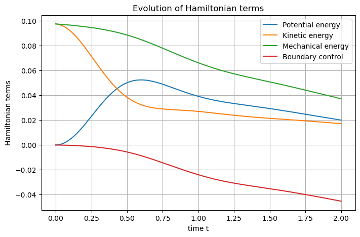

Another wave equation
=====================

.. automodule:: scrimp.examples.wave_coenergy
   :members:
   :undoc-members:
   :show-inheritance:

The objective of this example is to show how sub-domains may be used,
and how substitutions reduce the computational burden: it assumes that
`this 2D wave example <Wave_2D>`_ has
already been studied.

Substitutions
-------------

The damped wave equation as a port-Hamiltonian system writes

.. math::

       \begin{pmatrix} \partial_t \alpha_q \\ \partial_t \alpha_p \\ f_r \end{pmatrix}
       =
       \begin{bmatrix} 0 & {\rm grad} & 0 \\ {\rm div} & 0 & -I \\ 0 & I^\top & 0 \end{bmatrix}
       \begin{pmatrix} e_q \\ e_p \\ e_r \end{pmatrix},

where :math:`\alpha_q` denotes the strain, :math:`\alpha_p` is the
linear momentum, :math:`e_q` is the stress, :math:`e_p` is the velocity
and :math:`(f_r,e_r)` is the dissipative port.

This system must be close with **constitutive relations**, which are

.. math::

       e_q = T \cdot \alpha_q, \qquad e_p = \frac{\alpha_p}{\rho}, \qquad e_r = \nu f_r,

where :math:`T` is the Young’s modulus, :math:`\rho` the mass density
and :math:`\nu` the viscosity. Inverting these relations and
substituting the results in the port-Hamiltonian system leads to the
**co-energy formulation** (or more generally **co-state formulation**)

.. math::

       \begin{pmatrix} T^{-1} \cdot \partial_t e_q \\ \rho \partial_t e_p \\ \nu^{-1} e_r \end{pmatrix}
       =
       \begin{bmatrix} 0 & {\rm grad} & 0 \\ {\rm div} & 0 & -I \\ 0 & I^\top & 0 \end{bmatrix}
       \begin{pmatrix} e_q \\ e_p \\ e_r \end{pmatrix}.

At the discrete level, this allows to reduce the number of degrees of
freedom by two.

**Remark:** In the example, :math:`\nu` only acts on a sub-domain,
*i.e.* it is theoretically null on the complementary, and thus is not invertible! To be able to invert it, it is then mandatory to restrict the
dissipative port to the sub-domain where :math:`\nu>0`.

Simulation
----------

Let us start quickly until the definition of the dissipative port.

.. code:: python

    # Import scrimp
    import scrimp as S
    
    # Init the distributed port-Hamiltonian system
    wave = S.DPHS("real")
    
    # Set the domain (using the built-in geometry `Concentric`)
    # Labels: Disk = 1, Annulus = 2, Interface = 10, Boundary = 20
    omega = S.Domain("Concentric", {"R": 1.0, "r": 0.6, "h": 0.1})
    
    # And add it to the dphs
    wave.set_domain(omega)
    
    ## Define the variables
    states = [
        S.State("q", "Stress", "vector-field"),
        S.State("p", "Velocity", "scalar-field"),
    ]
    # Use of the `substituted=True` keyword to get the co-energy formulation
    costates = [
        S.CoState("e_q", "Stress", states[0], substituted=True),
        S.CoState("e_p", "Velocity", states[1], substituted=True),
    ]
    
    # Add them to the dphs
    for state in states:
        wave.add_state(state)
    for costate in costates:
        wave.add_costate(costate)

In order to restrict the dissipative port to the internal disk, we use
the ``region`` keyword.

.. code:: python

    # Define the dissipative port, only on the subdomain labelled 1 = the internal disk
    ports = [
        S.Port("Damping", "e_r", "e_r", "scalar-field", substituted=True, region=1),
    ]
    
    # Add it to the dphs
    for port in ports:
        wave.add_port(port)

The control port is only at the external boundary, labelled by 20 in
**SCRIMP**.

.. code:: python

    # Define the control port
    control_ports = [
        S.Control_Port(
            "Boundary control",
            "U",
            "Normal force",
            "Y",
            "Velocity trace",
            "scalar-field",
            region=20,
        ),
    ]
    
    # Add it to the dphs
    for ctrl_port in control_ports:
        wave.add_control_port(ctrl_port)

The sequel is as for the already seen examples.

.. code:: python

    # Define the Finite Elements Method of each port
    FEMs = [
        S.FEM(states[0].get_name(), 1, "DG"),
        S.FEM(states[1].get_name(), 2, "CG"),
        S.FEM(ports[0].get_name(), 1, "DG"),
        S.FEM(control_ports[0].get_name(), 1, "DG"),
    ]
    
    # Add them to the dphs
    for FEM in FEMs:
        wave.add_FEM(FEM)
    
    # Define physical parameters: care must be taken, 
    # in the co-energy formulation, some parameters are
    # inverted in comparison to the classical formulation
    parameters = [
        S.Parameter(
            "Tinv",
            "Young's modulus inverse",
            "tensor-field",
            "[[5+x,x*y],[x*y,2+y]]",
            "q",
        ),
        S.Parameter("rho", "Mass density", "scalar-field", "3-x", "p"),
        S.Parameter(
            "nu",
            "Viscosity",
            "scalar-field",
            "10*(0.36-(x*x+y*y))",
            ports[0].get_name(),
        ),
    ]
    
    # Add them to the dphs
    for parameter in parameters:
        wave.add_parameter(parameter)

Regarding the ``Brick`` objects, there is a major difference with the
previous examples: here, we need to list **all** the sub-domain labels
for the wave equation, hence the ``[1,2]``. On the other hand, the
dissipation only occurs on the internal disk, labelled 1, and thus the
block matrices corresponding to the identity operators which implement
the dissipation **must be restrict to** ``[1]``.

.. code:: python

    # Define the pHs via `Brick` == non-zero block matrices == variational terms
    # Since we use co-energy formulation, constitutive relations are already taken into
    # account in the mass matrices M_q and M_p
    bricks = [
        ## Define the Dirac structure
        # Define the mass matrices from the left-hand side: the `flow` part of the Dirac structure
        S.Brick("M_q", "q.Tinv.Test_q", [1, 2], dt=True, position="flow"),
        S.Brick("M_p", "p*rho*Test_p", [1, 2], dt=True, position="flow"),
        S.Brick("M_r", "e_r/nu*Test_e_r", [1], position="flow"),
        S.Brick("M_Y", "Y*Test_Y", [20], position="flow"),
        # Define the matrices from the right-hand side: the `effort` part of the Dirac structure
        S.Brick("D", "Grad(p).Test_q", [1, 2], position="effort"),
        S.Brick("-D^T", "-q.Grad(Test_p)", [1, 2], position="effort"),
        S.Brick("I_r", "e_r*Test_p", [1], position="effort"),
        S.Brick("B", "U*Test_p", [20], position="effort"),
        S.Brick("-I_r^T", "-p*Test_e_r", [1], position="effort"),
        S.Brick("-B^T", "-p*Test_Y", [20], position="effort"),
        ## Define the constitutive relations
        # Already taken into account in the Dirac Structure!
    ]
    
    # Add all these `Bricks` to the dphs
    for brick in bricks:
        wave.add_brick(brick)

The remaining part of the code have already been explain in previous
examples.

.. code:: python

    ## Initialize the problem
    # The controls expression
    expressions = ["0.5*Y"]
    
    # Add each expression to its control_port
    for control_port, expression in zip(control_ports, expressions):
        # Set the control functions (automatic construction of bricks such that -M_u u + f(t) = 0)
        wave.set_control(control_port.get_name(), expression)
    
    # Set the initial data
    wave.set_initial_value("q", "[0., 0.]")
    wave.set_initial_value("p", "2.72**(-20*((x-0.5)*(x-0.5)+(y-0.5)*(y-0.5)))")
    
    ## Solve in time
    # Define the time scheme ("cn" is Crank-Nicolson)
    wave.set_time_scheme(ts_type="cn",
                         t_f=2.0, 
                         dt_save=0.01,
                         )
    
    # Solve
    wave.solve()
    
    ## Post-processing
    ## Set Hamiltonian's name
    wave.hamiltonian.set_name("Mechanical energy")
    # Define each Hamiltonian Term
    terms = [
        S.Term("Potential energy", "0.5*q.Tinv.q", [1, 2]),
        S.Term("Kinetic energy", "0.5*p*p*rho", [1, 2]),
    ]
    # Add them to the Hamiltonian
    for term in terms:
        wave.hamiltonian.add_term(term)
    
    # Plot the Hamiltonian and save the output
    wave.plot_Hamiltonian(save_figure=True)

