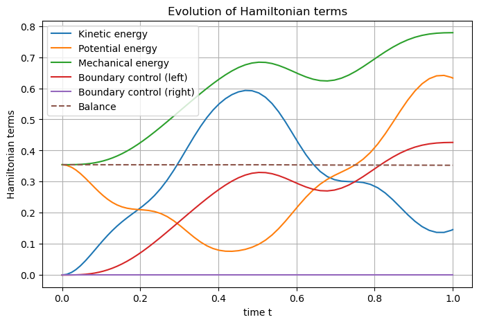

Getting started
===============

**!TO UPDATE!**

In order to start using **SCRIMP**, you have to work in the conda environment *scrimp* from the installation.

To understand the coding philosophy of **SCRIMP**, let us consider the 1D wave equation with Neumann boundary control

.. math::

    \left\lbrace
    \begin{array}{rcl}
    \rho(x) \partial_{tt}^2 w(t,x) - \partial_x \left( T(x) \partial_x w(t,x) \right) &=& 0, \qquad t \ge 0, x \in (0,1), \\
    \partial_t w(0,x) &=& v(x), \qquad x \in (0,1), \\
    \partial_x w(0,x) &=& s(x), \qquad x \in (0,1), \\
    \partial_x \left( T(0) w(t,0) \right) &=& u_L(t), \qquad t \ge 0, \\
    \partial_x \left( T(1) w(t,1) \right) &=& u_R(t), \qquad t \ge 0.
    \end{array}
    \right.

where :math:`w` denotes the deflection from the equilibrium position of a string, :math:`\rho` is its mass density and :math:`T` the Young's modulus.

The physics giving this equation has to be restated in the port-Hamiltonian formalism first.

Port-Hamiltonian framework
--------------------------

Let :math:`\alpha_q := \partial_x w` denotes the *strain* and :math:`\alpha_p := \rho \partial_t w` the *linear momentum*. One can express the total mechanical energy lying in the system :math:`\mathcal{H}`, the **Hamiltonian**, as

.. math::

    \mathcal{H}(t) = \mathcal{H}(\alpha_q(t,x), \alpha_p(t,x)) := \underbrace{\frac{1}{2} \int_0^1 \alpha_q(t,x) T(x) \alpha_q(t,x) {\rm d}x}_{\text{Potential energy}} + \underbrace{\frac{1}{2} \int_0^1 \frac{\alpha_p(t,x)^2}{\rho(x)} {\rm d}x}_{\text{Kinetic energy}}.

The variables :math:`\alpha_q` and :math:`\alpha_p` are known as the **state variables**, or in the present case since :math:`\mathcal{H}` represents an energy, the **energy variables**.

Computing the `variational derivative <https://en.wikipedia.org/wiki/Functional_derivative>`_ of :math:`\mathcal{H}` with respect to these variables leads to the **co-state variables**, or in our case the **co-energy variables**, *i.e.*

.. math::

    e_q := \delta_{\alpha_q} \mathcal{H} = T \alpha_q, \qquad e_p := \delta_{\alpha_p} \mathcal{H} = \frac{\alpha_p}{\rho},

that is the *stress* and the *velocity* respectively.

Newton's second law and Schwarz's lemma give the following dynamics

.. math::

    \begin{pmatrix} \partial_t \alpha_q \\ \partial_t \alpha_p \end{pmatrix}
    =
    \begin{bmatrix} 0 & \partial_x \\ \partial_x & 0 \end{bmatrix}
    \begin{pmatrix} e_q \\ e_p \end{pmatrix}.

Of course, trivial substitutions in this system would lead again to the initial string equation in second-order form. However, by keeping the system as is, an important structure appears. Indeed, the matrix of operators above is *formally* skew-symmetric. In other words, for all test functions :math:`f_q` and :math:`f_p` (compactly supported :math:`C^\infty` functions), one has thanks to integration by parts

.. math::

    \begin{pmatrix} f_q & f_p \end{pmatrix}
    \begin{bmatrix} 0 & \partial_x \\ \partial_x & 0 \end{bmatrix}
    \begin{pmatrix} e_q \\ e_p \end{pmatrix} = 0.

Together with the boundary Neumann condition, and defining *collocated* Dirichlet observations, this defines a (Stokes-) **Dirac structure**, where solutions along time, *i.e.* *trajectories*, will belong.

The port-Hamiltonian system representing a (linear) vibrating string with Neumann boundary control and Dirichlet boundary observation then writes

.. math::

    \begin{pmatrix} \partial_t \alpha_q \\ \partial_t \alpha_p \end{pmatrix}
    =
    \begin{bmatrix} 0 & \partial_x \\ \partial_x & 0 \end{bmatrix}
    \begin{pmatrix} e_q \\ e_p \end{pmatrix},

.. math::

    \left\lbrace
    \begin{array}{rcl}
    e_q(t,0) &=& u_L(t), \\
    e_q(t,1) &=& u_R(t), \\
    y_L(t) &=& e_p(t,0), \\
    y_R(t) &=& e_p(t,1),
    \end{array}
    \right.

.. math::

    \left\lbrace
    \begin{array}{rcl}
    e_q &=& T \alpha_q, \\
    e_p &=& \frac{\alpha_p}{\rho}.
    \end{array}
    \right.

The two first blocks, giving in particular the dynamics, define the **Dirac structure** of the system. The third block is known as the **constitutive relations**, and is needed to ensure uniqueness of solutions.

The importance of the **Dirac structure** relies, in particular, in the fact that it encloses the **power balance** satisfied by the **Hamiltonian**. Indeed, along the trajectories, one has

.. math::

    \frac{\rm d}{{\rm d}t} \mathcal{H}(t) = \frac{\rm d}{{\rm d}t} \mathcal{H}(\alpha_q(t), \alpha_p(t)) = \underbrace{y_R(t) u_R(t) - y_L(t) u_L(t)}_{\text{power flowing through the boundaries}}

In other words, the **Dirac structure** encodes the way the system communicates with its environment. In the present example, it says that the variation of the total mechanical energy is given by the power supplied to the system at the boundaries.

Each couple :math:`(\partial_t \alpha_q, e_q)`, :math:`(\partial_t \alpha_p, e_p)`, :math:`(u_L, y_L)` and :math:`(u_R, y_R)` is a **port** of the port-Hamiltonian system, and is associated to a term in the **power balance**.

Structure-preserving discretization
-----------------------------------

The objective of a structure-preserving discretization method is to obtain a **finite-dimensional Dirac structure** that encloses a *discrete version* of the power balance. There is several ways to achieve this goal, but **SCRIMP** focuses on a particular application of the Mixed Finite Element Mehod, called the **Partitioned Finite Element Method**.

**Remark:** The 1D case does simplify the difficulties coming from the boundary terms. Indeed, here the functional spaces for the controls :math:`u_L`, :math:`u_R` and the observations :math:`y_L`, :math:`y_R` are nothing but :math:`\mathbb{R}`.

Let :math:`\varphi_q` and :math:`\varphi_p` be smooth test functions, and $\delta_{mx}$ denote the Kronecker symbol. One can write the weak formulation of the **Dirac Structure** as follows

.. math::

    \left\lbrace
    \begin{array}{rcl}
    \int_0^1 \partial_t \alpha_q(t,x) \varphi_q(x) {\rm d}x &=& \int_0^1 \partial_x e_p(t,x) \varphi_q(x) {\rm d}x, \\
    \int_0^1 \partial_t \alpha_p(t,x) \varphi_p(x) {\rm d}x &=& \int_0^1 \partial_x e_q(t,x) \varphi_p(x) {\rm d}x, \\
    y_L(t) &=& \delta_{0x} e_p(t,x), \\
    y_R(t) &=& \delta_{1x} e_p(t,x),
    \end{array}
    \right.

Integrating by parts the second line make the controls appear

.. math::

    \left\lbrace
    \begin{array}{rcl}
    \int_0^1 \partial_t \alpha_q(t,x) \varphi_q(x) {\rm d}x &=& \int_0^1 \partial_x e_p(t,x) \varphi_q(x) {\rm d}x, \\
    \int_0^1 \partial_t \alpha_p(t,x) \varphi_p(x) {\rm d}x &=& - \int_0^1 e_q(t,x) \partial_x \varphi_p(x) {\rm d}x + u_R(t) \varphi_p(1) - u_L(t) \varphi_p(0), \\
    y_L(t) &=& \delta_{0x} e_p(t,x), \\
    y_R(t) &=& \delta_{1x} e_p(t,x),
    \end{array}
    \right.

Now, let :math:`(\varphi_q^i)_{1 \le i \le N_q}` and :math:`(\varphi_p^i)_{1 \le k \le N_p}` be two finite families of approximations for the :math:`q`-type port and the :math:`p`-type port respectively, typically finite element families, and write the discrete weak formulation with those families, one has for all :math:`1 \le i \le N_q` and all :math:`1 \le k \le N_p`

.. math::

    \left\lbrace
    \begin{array}{rcl}
    \sum_{j=1}^{N_q} \int_0^1 \varphi_q^j(x) \varphi_q^i(x) {\rm d}x \, \frac{\rm d}{{\rm d}t} \alpha_q^j(t) &=& \sum_{k=1}^{N_p} \int_0^1 \partial_x \varphi_p^k(x) \varphi_q^j(x) {\rm d}x \, e_p^k(t), \\
    \sum_{\ell=1}^{N_p} \int_0^1 \varphi_p^\ell(x) \varphi_p^k(x) {\rm d}x \, \frac{\rm d}{{\rm d}t} \alpha_p^\ell(t) &=& - \sum_{i=1}^{N_q} \int_0^1 \varphi_q^i(x) \partial_x \varphi_p^k(x) {\rm d}x \, e_q^i(t) \\
    && \qquad \qquad + u_R(t) \varphi_p^k(1) - u_L(t) \varphi_p^k(0), \\
    y_L(t) &=& \sum_{k=1}^{N_p} \varphi_p^k(0) \, e_p^k(t), \\
    y_R(t) &=& \sum_{k=1}^{N_p} \varphi_p^k(1) \, e_p^k(t),
    \end{array}
    \right.

which rewrites in matrix form

.. math::

    \underbrace{\begin{bmatrix}
    M_q & 0 & 0 & 0 \\
    0 & M_p & 0 & 0 \\
    0 & 0 & 1 & 0 \\
    0 & 0 & 0 & 1
    \end{bmatrix}}_{= M}
    \begin{pmatrix}
    \frac{\rm d}{{\rm d}t} \underline{\alpha_q}(t) \\
    \frac{\rm d}{{\rm d}t} \underline{\alpha_p}(t) \\
    - y_L(t) \\
    - y_R(t)
    \end{pmatrix}
    =
    \underbrace{\begin{bmatrix}
    0 & D & 0 & 0 \\
    -D^\top & 0 & B_L & B_R \\
    0 & -B_L^\top & 0 & 0 \\
    0 & -B_R^\top & 0 & 0
    \end{bmatrix}}_{= J}
    \begin{pmatrix}
    \underline{e_q}(t) \\
    \underline{e_p}(t) \\
    u_L(t) \\
    u_R(t)
    \end{pmatrix},

where :math:`\underline{\alpha_\star}(t) := \begin{pmatrix} \alpha_\star^1(t) & \cdots & \alpha_\star^{N_\star} \end{pmatrix}^\top`, :math:`\underline{e_\star}(t) := \begin{pmatrix} e_\star^1(t) & \cdots & e_\star^{N_\star} \end{pmatrix}^\top`, and

.. math::

    (M_q)_{ij} := \int_0^1 \varphi_q^j(x) \varphi_q^i(x) {\rm d}x,
    \qquad
    (M_p)_{k\ell} := \int_0^1 \varphi_p^\ell(x) \varphi_p^k(x) {\rm d}x,

.. math::

    (D)_{ik} := \int_0^1 \partial_x \varphi_p^k(x) \varphi_q^i(x) {\rm d}x,
    \qquad
    (B_L)_{k} := \varphi_p^k(0),
    \qquad
    (B_R)_{k} := \varphi_p^k(1),

The left-hand side constitutes the **flow** of the **Dirac structure**, while the right-hand side is called **effort**.

Now one can approximate the **constitutive relations** in those families by projection of their weak formulation

.. math::

    \left\lbrace
    \begin{array}{rcl}
    \int_0^1 e_q(t,x) \varphi_q(x) {\rm d}x &=& \int_0^1 T(x) \alpha_q(t,x) \varphi_q(x) {\rm d}x, \\
    \int_0^1 e_p(t,x) \varphi_p(x) {\rm d}x &=&  \int_0^1 \frac{\alpha_p(t,x)}{\rho(x)} \varphi_p(x) {\rm d}x,
    \end{array}
    \right.

from which one can deduce the matrix form of the discrete weak formulation of the constitutive relation

.. math::

    \left\lbrace
    \begin{array}{rcl}
    M_q \underline{e_q}(t) &=& M_T \underline{\alpha_q}(t), \\
    M_p \underline{e_p}(t) &=& M_\rho \underline{\alpha_p}(t),
    \end{array}
    \right.

where

.. math::

    (M_T)_{ij} := \int_0^1 T(x) \varphi_q^j(x) \varphi_q^i(x) {\rm d}x,
    \qquad
    (M_\rho)_{k\ell} := \int_0^1 \frac{\varphi_p^\ell(x)}{\rho(x)} \varphi_p^k(x) {\rm d}x.

Finally, the **discrete Hamiltonian** :math:`\mathcal{H}^d` is defined as the evaluation of :math:`\mathcal{H}^d` on the approximation of the **state variables**

.. math::

    \mathcal{H}^d(t) := \mathcal{H}(\alpha_q^d(t,x), \alpha_p^d(t)) = \frac{1}{2} \underline{\alpha_q}(t)^\top M_T \underline{\alpha_q}(t) + \frac{1}{2} \underline{\alpha_p}(t)^\top M_\rho \underline{\alpha_p}(t). 

The **discrete power balance** is then easily deduced from the above matrix formulations, thanks to the symmetry of :math:`M` and the skew-symmetry of :math:`J`

.. math::

    \frac{\rm d}{{\rm d}t} \mathcal{H}^d(t) = y_R(t) u_R(t) - y_L(t) u_L(t).

**Remark:** The discrete system that has to be solve numerically is a Differential Algebraic Equation (DAE). There exists some case (as in this example), where one can write the **co-state** formulation of the system by substituting the **constitutive relations** at the continuous level to get a more classical Ordinary Differential Equation (EDO)

.. math::

    \begin{bmatrix}
    \widetilde{M}_q & 0 & 0 & 0 \\
    0 & \widetilde{M}_p & 0 & 0 \\
    0 & 0 & 1 & 0 \\
    0 & 0 & 0 & 1
    \end{bmatrix}
    \begin{pmatrix}
    \frac{\rm d}{{\rm d}t} \underline{e_q}(t) \\
    \frac{\rm d}{{\rm d}t} \underline{e_p}(t) \\
    - y_L(t) \\
    - y_R(t)
    \end{pmatrix}
    =
    \begin{bmatrix}
    0 & D & 0 & 0 \\
    -D^\top & 0 & B_L & B_R \\
    0 & -B_L^\top & 0 & 0 \\
    0 & -B_R^\top & 0 & 0
    \end{bmatrix}
    \begin{pmatrix}
    \underline{e_q}(t) \\
    \underline{e_p}(t) \\
    u_L(t) \\
    u_R(t)
    \end{pmatrix},

where this time the mass matrices on the left-hand side are both *weighted* with respect to the physical parameters

.. math::

    (\widetilde{M}_q)_{ij} := \int_0^1 T^{-1}(x) \varphi_q^j(x) \varphi_q^i(x) {\rm d}x,
    \qquad
    (\widetilde{M}_p)_{k\ell} := \int_0^1 \rho(x) \varphi_p^\ell(x) \varphi_p^k(x) {\rm d}x.

Coding within SCRIMP
--------------------

The following code is available in the file :code:`wave_1D.py` of the *sandbox* folder of scrimp.

To start, import the scrimp module `dpHs` for the discretization of *distributed port-Hamiltonian system*, and initiate a dpHs called, *e.g.*, `wave`

.. code-block:: python
    
    from scrimp.dpHs import dpHs
    
    wave = dpHs('real')

Then, define the domain :math:`\Omega = (0,1)`, with a mesh-size parameter :math:`h`

.. code-block:: python
   
    wave.set_domain('Interval', {'L': 1., 'h': 0.01})
   
This creates a mesh of the interval :math:`\Omega = (0,1)`. **Important to keep in mind**: the domain is composed of `regions`, denoted by integers. The *built-in* geometry of an interval available in the code returns 1 for the domain :math:`\Omega`, 10 for the left-end and 11 for the right-end. Informations about available geometries and the indices of their regions can be found in the documentation or via :code:`built_in_geometries()` after an import :code:`import scrimp.utils.mesh`.

On this domain, we define two **states** and two **co-states**. At this stage, we only set each couple to be part of the same **port**.

.. code-block:: python

    wave.add_state('q', 'Strain', 'scalar-field')
    wave.add_costate('e_q', 'Stress', 'q')

    wave.add_state('p', 'Linear momentum', 'scalar-field')
    wave.add_costate('v', 'velocity', 'p')

These calls create automatically two *non-algebraic* **ports**, named after their respective **state**. Note that we simplify the notations and do not write `alpha_q` and `alpha_p` but `q` and `p` for the sake of readability.

Finally, we add the two control-observation **ports** with

.. code-block:: python

    wave.add_control_port('Boundary control (left)', 'U_L', 'Velocity', 'Y_L', 'Normal force', 'scalar-field', region=10)
    wave.add_control_port('Boundary control (right)', 'U_R', 'Velocity', 'Y_R', 'Normal force', 'scalar-field', region=11)

Note the crucial keyword *region* to restrict each port to its end. By default, it would apply everywhere.

**Syntaxic note:** although :math:`y` is the observation in the theory of port-Hamiltonian systems, it is also the second space variable in N-D problems. This name is thus reserved for this aim and forbidden in all definitions of a dpHs. Nevertheless, the code being case-sensitive, it is possible to name the observation :code:`Y`. To avoid mistakes, we take the habit to always use this syntax, this is why we denoted our controls and observations with capital letters even if the problem does not occur in this example.

To be able to write the discrete weak formulation of the system, one need to set four finite element families, associated to each **port**. Only two arguments are mandatory: the *name* of the port and the *degree* of the approximations.

.. code-block:: python

    wave.add_FEM('q', 2)
    wave.add_FEM('p', 1)
    wave.add_FEM('Boundary control (left)', 1)
    wave.add_FEM('Boundary control (right)', 1)

This will associated a family of Lagrange finite elements (default choice) to each port, with the prescribed order. Remember that the boundary is only 2 disconnected points in this 1D case, so the only possibility for the finite element is 1 degree of freedom on each of them: Lagrange elements of order 1 is the easy way to do that.

It is now possible to write the weak forms defining the matrix :math:`M` of the discrete Dirac structure. Only the non-zero blocks are mandatory. Furthermore, the place of the block is automatically determined by GetFEM. The syntax follow a simple rule: the unknown trial function :code:`q` is automatically associated to the test function :code:`Test_q` (note the capital T), and so on.

.. code-block:: python

    wave.add_brick('M_q', 'q*Test_q', [1], dt=True, position='flow')
    wave.add_brick('M_p', 'p*Test_p', [1], dt=True, position='flow')
    wave.add_brick('M_Y_L', 'Y_L*Test_Y_L', [10], position='flow')
    wave.add_brick('M_Y_R', 'Y_R*Test_Y_R', [11], position='flow')

The first argument is a human-readable name, the second one is the form, the third is a list (hence the [ and ]) of integers, listing all the regions where the form applies. The optional parameter :code:`dt=True` is to inform **SCRIMP** that this block matrix will apply on the time-derivative of the unknown trial function, and finally the option parameter :code:`position='flow'` informs **SCRIMP** that this block is a part of the *flow* side of the Dirac structure. So the above call construct

.. math::

    \begin{bmatrix}
    M_q & 0 & 0 & 0 \\
    0 & M_p & 0 & 0 \\
    0 & 0 & M_{Y_L} & 0 \\
    0 & 0 & 0 & M_{Y_R}
    \end{bmatrix}
    
Note that in definitive, :code:`M_Y_L` and :code:`M_Y_R` are both equal to 1 in this example.

Following the same principle, we can construct the *effort* side with

.. code-block:: python

    wave.add_brick('D', 'Grad(e_p)*Test_q', [1], position='effort')

    wave.add_brick('-D^T', '-e_q*Grad(Test_p)', [1], position='effort')
    wave.add_brick('B_L', 'U_L*Test_p', [10], position='effort')
    wave.add_brick('B_R', 'U_R*Test_p', [11], position='effort')

    wave.add_brick('-B_L^T', '-e_p*Test_Y_L', [10], position='effort')
    wave.add_brick('-B_R^T', '-e_p*Test_Y_R', [11], position='effort')

As already said, **constitutive relations** are needed to ensure uniqueness, hence well-posedness. The physical parameters of the experiment are gathered in these relations, so the parameters have to be defined first. In **SCRIMP**, a *parameter* is associated to a *port*.

.. code-block:: python

    wave.add_parameter('T', 'Young\'s modulus', 'scalar-field', '1', 'q')
    wave.add_parameter('rho', 'Mass density', 'scalar-field', '1 + x*(1-x)', 'p')

The first argument will be the string that can be used in forms, the second argument is a human-readable description, the third one set the kind of the parameter, the fourth one is the mathematical expression defining the parameter, and finally the fifth argument is the name of the associated port.

These parameters at hand, one can now define the constitutive relations.

**Syntaxic note:** the constitutive relations have to be written under an implicit formulation F = 0. Keep in mind that a minus sign will often appear because of that.

.. code-block:: python

    wave.add_brick('-M_e_q', '-e_q*Test_e_q', [1])
    wave.add_brick('CR_q', 'q*T*Test_e_q', [1])

    wave.add_brick('-M_e_p', '-e_p*Test_e_p', [1])
    wave.add_brick('CR_p', 'p/rho*Test_e_p', [1])

The port-Hamiltonian system is now fully stated. It remains to set the initial values of the states and the controls before solving

.. code-block:: python

    wave.set_control('Boundary control (left)', 'sin(2*pi*t)')
    wave.set_control('Boundary control (right)', '0.')

    wave.set_initial_value('q', '10.')
    wave.set_initial_value('p', 'np.exp(-50.*(x-0.5)*(x-0.5))')

We can now solve the system (with default experiment parameter)

.. code-block:: python

    wave.solve()

To end, one can also add the Hamiltonian terms and plot the contribution of each port to the balance equation

.. code-block:: python

    wave.set_Hamiltonian_term('Kinetic energy', '0.5*p*p/rho', [1])
    wave.set_Hamiltonian_term('Potential energy', '0.5*q*T*q', [1])

    wave.plot_Hamiltonian()

One can appreciate the *structure-preserving* property by looking at the dashed line, showing the evolution of

.. math::

    \mathcal{H}^d(t) - \int_0^t u_R(s) y_R(s) {\rm d}s + \int_0^t u_L(s) y_L(s) {\rm d}s

And now? It is time to see `more examples <examples.html>`_.

